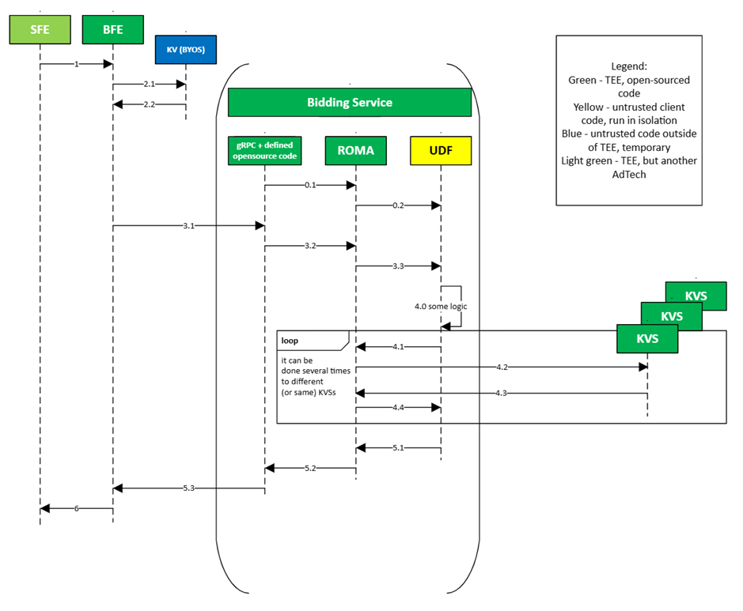

# TEE Ad Candidate real-time Selection

One of the major features of the Ad Selection API is its ability to allow Ad Techs to select ad auction candidates from large candidate databases in real time, without being restricted to a limited list of creatives matched to an exact Interest Group. This solution was designed with two key considerations in mind: preventing data leakage from the secure TEE environment and ensuring the usability and applicability of the approach.

Our primary concept is to provide a configurable, ready-to-deploy container that can be used for real-time selection. In this setup, all Ad Techs need to do is deploy the container using the prepared scripts, configure it, and upload their candidates to the cloud. Additionally, Ad Techs will need to prepare UDF that can be included as part of the configuration.

The selection process itself can occur in one of two ways:

- Lookup-based selection: Candidates are matched with specific “keywords” that must be passed to the container during the request.
- Embedding-based selection: Embeddings of all possible candidates are grouped into an ANN (Approximate Nearest Neighbor) index. In this case, the index is uploaded into the container and used to find the nearest neighbors during the ad request using embeddings from the request.

## Ad Selection API selection request flow
The selection workflow is initiated during the ad request, starting with a Bidding Service UDF call. During this call, the UDF can trigger a selection request to the container (referred to here as the KVS service). This is accomplished through a specific hook that triggers an external request to a pre-registered TEE service. After the request to KVS, another UDF call is triggered inside KVS, allowing it to utilize both the `GetValues` and `GetNearestNeighbors`  hooks — the former for KV lookups and the latter for ANN queries. Once the request is executed, the UDF on the KVS side processes the data and responds to the Bidding Service, where the Bidding UDF can use the new candidates in the auction. This workflow is illustrated in the diagram below:
<span style="display:block;text-align:center"></span>

## Key/Value Service specifications
The KVS image will utilize an open-source service. This service allows you to upload a Key-Value database and indexes for use in ANN selection.

The KVS leverages an internal ANN implementation based on [Microsoft's DiskANN algorithm](https://github.com/microsoft/DiskANN/tree/main), which is designed for scalable, fast, fresh, and filtered Approximate Nearest Neighbor (ANN) searches. DiskANN, developed by Microsoft, is known for its balance of quality and performance in finding nearest neighbors.

Internally, the KVS manages several independent components:

- **DataOrchestrator**: Tracks all data updates and ensures everything remains current.
- **Cache**: Handles all internal lookup requests.
- **AnnIndex**: Manages all ANN lookup operations.
- **Server**: Receives and processes all incoming requests.
- **Roma and Sandbox**: Executes UDFs (User-Defined Functions).

## Key/Value Service request lifetime
Once the server receives a request, it is almost immediately passed to the UDF, which then determines how to process it. The UDF has access to several hooks, including `GetValues` and `GetNearestNeighbors`. When `GetValues` is called, the KVS looks up each key from the hook's input and returns the corresponding values. When `GetNearestNeighbors`  is called, instead of a direct lookup, an ANN search is initiated, resulting in a set of candidates — the closest neighbors. These results are then accessible to the UDF, whose role is to package these results as the KVS response.

In most cases, the UDF code for selection will performs three main tasks: accepting the UDF input, directing it to the appropriate hook, and packaging the hook's response as the UDF's output.

## KVS request/response schema
### KVS request schema (same as ad retrieval v2 kvs schema)
```proto
message Request {
    message Partition {
        message Argument {
            optional repeated string tags = 1; // List of tags describing this group's attributes
            optional repeated string data = 2; // List of keys to get values for
        };
        message Metadata {
            optional single string hostname = 1; // The hostname of the top-level frame calling runAdAuction().
            optional single string experimentGroupId = 2;
            optional single string slotSize = 3; // Available if trustedBiddingSignalsSlotSizeMode=slot-size. In the form of <width>,<height>
            optional single string allSlotsRequestedSizes = 4; // Available if trustedBiddingSignalsSlotSizeMode=all-slots-requested-sizes. In the form of <width1>,<height1>,<width2>,<height2>,...
        };
        required single uint id = 1; // Unique id of the partition in this request
        required single uint compressionGroupId = 2; // Unique id of a compression group in this request. Only partitions belonging to the same compression group will be compressed together in the response
        optional single Metadata metadata = 3;
        required repeated Argument arguments = 4; // List - group of keys and common attributes about them
    };
    optional repeated string acceptCompression = 1; // Algorithm accepted by the browser for the response. ["none", "gzip", "brotli"]
    required repeated Partition partitions = 2; // Single partition object. A collection of keys that can be processed together
}
```

This schema is the unmodified KVS v2 schema from Google’s service [Protected Auction Key/Value Service](https://github.com/privacysandbox/protected-auction-key-value-service). The UDF triggers a request where all information for a specific model, selection type, or service type is passed within a single Partition, though it may be split into several "Argument" sections (keyword groups). For instance, if we want to trigger a call for one model, we place the data in one partition; for a different selection type, we use another partition. All actual keys or embeddings are stored in the "Argument" message with the tag "keys." If we need to specify a model name, we pass an "Argument" message with the tag "model" to indicate which model should be triggered. Similarly, if we need to pass user information or additional data, we use the "Argument" message with the tag "add," and this information will be passed to the UDF on the KVS side.
### KVS Response Schema (same as ad retrieval v2 kvs schema)

```proto
message CompressionGroup { 
    message Elem { 
        message KeyGroupOutput { 
            optional repeated string tags; 
            optional repeated string keyValues; // JSONS 
        }; 
        optional single uint id = 1; 
        optional repeated KeyGroupOutput keyGroupOutputs = 2; 
    }; 
    optional repeated Elem elems = 1; 
} 
message Response { 
    message EncryptedCompressionGroup { 
        optional single compressionGroupId = 1; 
        optional single uint ttl_ms = 2; // Adtech-specified TTL for client-side caching. In milliseconds. Unset means no caching. 
        optional single bytes content = 3; // compressed CBOR binary string, CompressionGroup 
    } 
    optional repeated EncryptedCompressionGroup = 1; // List - object for a compression group, compressed using the algorithm specified in the request 
} 
```

Each partition has the same ID as in request and the same order of keys inside “Argument” with keys. In this case for each key, we have independent result. In case if we want to pass additional information, we need to pass it through “Argument” with tag “add”.

## Index/Database generation
Microsoft will provide tools to generate indexes that can be used with KVS images. However, the task of generating embeddings will need to be handled by the buyer. DiskANN supports several embedding types, including `float`, `uint8`, and `int8` multi-dimensional vectors. To use the index-generation tools, Ad Techs will need to provide a `.csv` file, where each row represents a single ad candidate. One column should contain the base64-encoded embedding, and another should contain the candidate's value in a format appropriate for the Ad Tech (e.g., a render URL or more complex JSON). The format of the value is flexible since it will be accessible in the KVS UDF for further processing. Once the `.csv` file is prepared, Ad Techs can run a script to generate the index. This index can then be uploaded to the cloud, where KVS can access and use it as a new index.

Similar tools are available for generating databases for direct lookup, but as with ANN, Ad Techs will need to prepare the content themselves.

## Restrictions
In the first release, the service will support only one ready-to-use index per container (which can be used alongside a single KV-database), with only snapshot uploads and no filtration capabilities. Future releases will introduce support for delta updates, filters, and multi-indexing.

The distance metric used will be Euclidean distance (L2).