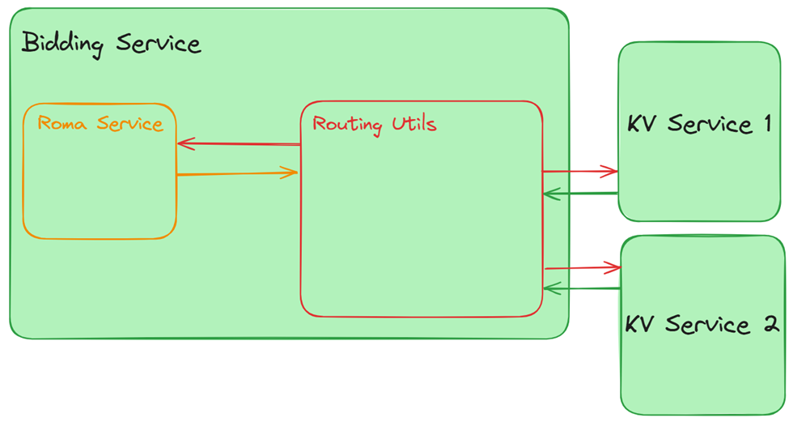
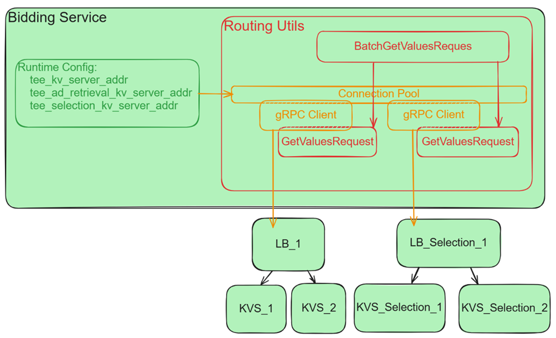

# Bidding Service Changes 
Bidding service will support new routing feature and new hook - `fetchAdditionalSignals` that allows to provide additional signals and do realtime selection.

## Routing Utils
To make a call to the Key-Value Service from the `generateBid` JavaScript function there is a newly added external function in the Roma Service.

<span style="display:block;text-align:center"></span>

Routing Utils will be initiated during the Bidding Service run process, and a new external function `fetchAdditionalSignals` will be registered within the Roma Service. Routing Utils will include a connection pool to various Key-Value Services (KVS), enabling the creator of the UDF function to make batch requests to different KVS. Routing Utils will validate the requests, determine the appropriate KVS to send them to, encrypt the requests, and then dispatch them. Once the responses are received, they will be aggregated and sent back to the JavaScript code.

The communication interface between the Roma Service and Routing Utils will be based on KVS protocol messages, with added support for bulk requests and information about the KVS destination.

### Routing request and rsponse schemas

```proto
message KVServerInfo {
  string server_name = 1;
}

message KVGetValuesRequest {
  KVServerInfo server_info = 1;
  kv_server.v2.GetValuesRequest get_values_request = 2;
}
message BatchKVGetValuesRequest {
  repeated KVGetValuesRequest requests = 1;
}

message KVGetValuesResponse {
  string server_name = 1;
  string error_message = 2;
  kv_server.v2.GetValuesResponse get_values_response = 3;
}
message BatchKVGetValuesResponse {
  repeated KVGetValuesResponse responses = 1;
  string error_message = 2;
}
```

- `GetValuesRequest` and `GetValuesResponse` are the structure from the [KVS proto schema](https://github.com/privacysandbox/protected-auction-key-value-service/blob/release-0.16/public/query/v2/get_values_v2.proto). 
- `KVServerInfo` has the information to which KVS we need to send request (either KVS with Selection or normal KVS).
- `BatchKVGetValuesRequest` and `BatchKVGetValuesResponse`structures that needed to support batch requests/responses. 

### Key-Value-Service destinations 
 In the UDF bidding function `generateBid`, the Ad Tech does not have direct information about the exact URLs or DNS names of the Key-Value Services destinations. Instead, the Ad Tech will use predefined KVS names within the UDF, and Routing Utils will resolve these names to the correct URLs (ensuring the appropriate gRPC channel is used). To support this, the Bidding Service runtime configuration will be extended with a new parameter: `tee_selection_kv_server_addr` in addition to the existing parameters `tee_ad_retrieval_kv_server_addr` and `tee_kv_server_addr`.

When UDF sends a request to KVS in the `RoutingRequest`, you need to specify the name `server_name` of the Key-Value Service. Currently, there are three predefined names: `KV_SERVER`, `AD_RETRIEVAL_KV_SERVER` and `SELECTION_KV_SERVER`. These names are directly mapped to the corresponding `*_kv_server_addr` parameters.

<span style="display:block;text-align:center"></span>

### Request Example in bidding UDF
```js
function generateBid(interest_group, auction_signals, buyer_signals, trusted_bidding_signals, device_signals) {

const batchKVGetValuesRequest = {
    requests: [
      {
        server_info: { server_name: 'KV_SERVER' },
        get_values_request: {
          client_version: 'v2',
          metadata: {
            hostname: 'example.com',
          },
          partitions: [
            {
              id: 0,
              compressionGroupId: 0,
              arguments: [
                {
                  tags: ['structured', 'groupNames'],
                  data: ['hello'],
                },
                {
                  tags: ['custom', 'keys'],
                  data: ['key1'],
                },
              ],
            },
          ],
          consented_debug_config: {
            is_consented: true,
            token: 'debug_token',
          },
          log_context: {
            generation_id: 'client_UUID',
            adtech_debug_id: 'adtech_debug_test',
          },
        },
      },
    ],
  };

  const jsonRequest = JSON.stringify(batchKVGetValuesRequest);
  const fetchAdditionalSignalsResult = fetchAdditionalSignals(jsonRequest);
```

-  `GetValueRequest` is the structure from [KVS proto file](https://github.com/privacysandbox/protected-auction-key-value-service/blob/release-0.16/public/query/v2/get_values_v2.proto#L105).