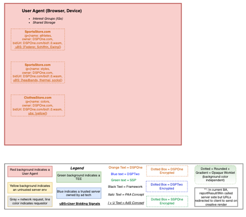
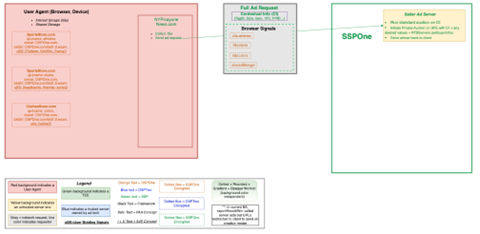
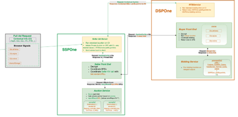
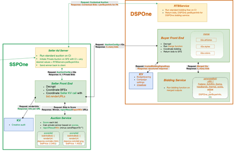
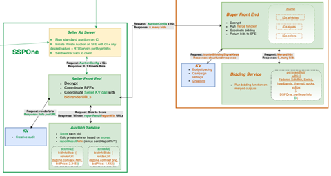
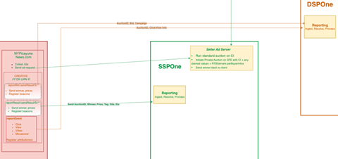
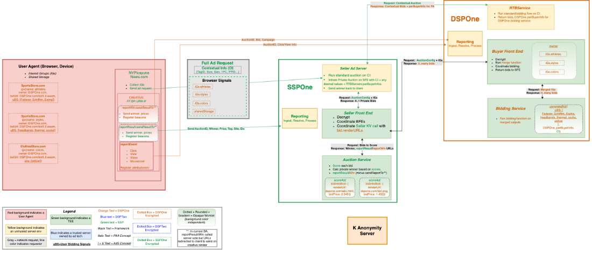
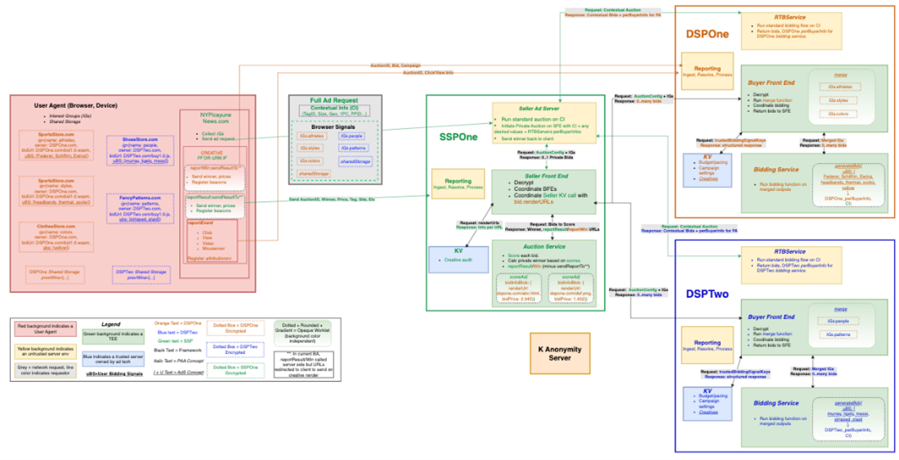

# Life of an ad request
This document describes the life of an ad auction using the Ad Selection API. The Ad Selection API auction uses a similar API surface area as a Protected Audience API auction to ensure ease of development while providing more flexibility around data usage in trusted environments, creative selection, and modeling.

We'll begin with a simple auction consisting of a single supply-side platform (SSP) and single demand-side platform (DSP) with two advertisers. This will help to isolate and illustrate the concepts, before we turn up the resolution to multiple DSPs, and even multiple SSPs in the next document.

# Step 0: Data onboarding
For a private auction to deliver value, advertisers must first onboard their data.

### Creation

When a consumer navigates to any site, the tech on that site can register data for usage in future private auctions. That data takes the form of interest groups (IGs). The tech on page can use the new JavaScript APIs exposed by the user agent to register and update that data.  For example, joining an athletes interest group:
```javascript
const myGroup = {
   'owner': 'https://www.dsp.site',
   'name': 'athletes',
   'updateUrl': '.../update-IG?id=athletes',
   'biddingLogicUrl': '.../biddingLogic.js',
   'userBiddingSignals': ["Federer", "Schiffrin", "Ewing"],
    'trustedBiddingSignalsUrl': '.../real-time-lookups',
    'trustedBiddingSignalsKeys': ['CampaignOne', 'CampaignTwo']
}
 const joinPromise = navigator.joinAdInterestGroup(myGroup, TTLInSeconds);
```

(See [API details](API%20Details.md) for a formal specification of the IG structure and joinAdInterestGroup signature. Note "..." in URLs is meant to reduce text; the entire URL is required).

### Update
The interest group can be updated in two ways:
- Future visits to the page that result in a call to `joinAdInterestGroup`, with an IG of the same name and owner, will result in the IG being updated (overwritten). The time-to-live (TTL) is reset in this case.
- The `updateUrl` will be called, by default once a day, and the returned results can overwrite most elements of the IG. Note that the TTL is not extended this case.

### Usage
Once the athletes IG has been successfully joined, the IG will live in the browser for the specified TTL. It will be able to participate in any Private Auction to which the publisher has invited its owner. The publisher can include either all owner's IGs available on the browser, or list DSP domains which will match on the `owner` field of the IGs.

To participate in an auction, the `biddingLogicUrl` must contain a function named `generateBid`. The Auction Framework will invoke that function and pass the entire IG, including `userBiddingSignals`, as well as the result of a call to `trustedBiddingSignalsUrl`. The `generateBid` function can return 0 or more bids for consideration by the SSPs ranking function. See Step 4 for more details.

### Summary
Step 0 is the precursor to a useful Private Auction running. The state of the world after DSP code on different sites joins IGs looks like this and forms the basis for the next steps.

<span style="display:block;text-align:center"></span>


# Step 1: Private auction initiation
After visiting her favorite sports and clothing sites, the consumer then goes to a publisher's website. The publisher makes some of their revenue based on advertising and believes advertisers will bid more if they can use their own data, so they run a private auction using the Ad Selection API.

## Combined ad request
First, the SSP code on page uses the new Ad Selection JS API to ask for an encrypted, opaque (which is unreadable outside of a TEE environment) blob of IGs that will be used by the buyers in Step 3. It then sends an ad request to its existing auction server, which is referred to here as the Seller Ad Service.  The ad request includes the encrypted blob of IGs as well as any available information it would have included previously, such as a PPID, contextual information like URL, sizes and locations of tags on page, etc.

```javascript
const auctionBlob = await navigator.getInterestGroupAdAuctionData({
  // 'seller' works the same as for runAdAuction.
  'seller': 'https://www.example-ssp.site',
  'coordinator': 'azure'
});
fetch('https://www.example-ssp.site/auction', {
  method: "POST",
  body: auctionBlob,
  ...
})
```
<span style="display:block;text-align:center"></span>

## Contextual auction

Once the seller ad service has received the request, it will typically run its existing auction flow prior to the private auction. Although this isn't strictly necessary, it can support existing demand that does not require IG data, and importantly, allows the participating DSPs to inject values into their own private bidding.

<span style="display:block;text-align:center"></span>

## Private auction

After the contextual auction finishes, the SSP initiates the private auction on its TEEs, passing in the opaque IG blob and an auction configuration that includes: the DSPs it wishes to include in the Private Auction; a URL containing a bid ranking function; `auctionSignals` that the DSPs need to understand the tags they are bidding on; and some operational signals that allow for control over the timing and resource usage of the auction.

The seller has two types of TEEs.
- The seller front end (SFE) handles sending IGs to the appropriate buyers, fetching real time signals for and invoking scoreAd in the Auction Service TEE, and finally returning 0 or 1 bids per auction to the Seller Ad Service.
- The auction service TEE handles ranking the opaque bids returned by the buyers, sorting and returning the winner, and generating the reporting URLs to send to the seller and winning buyer on render.

The Seller Ad Service sends the IG Blob and `auctionConfig` to the Seller Front End and awaits its response:

```javascript
const myAuctionConfig = {
    'seller': 'https://www.example-ssp.site',
    'interestGroupBuyers': ['...dsp-one.site', 'dsp-two.site', ...],
    'decisionLogicUrl': '.../bid-ranking-function.js',
    'trustedScoringSignalsUrl': '.../creative-audit-scores',
    'auctionSignals': {'size': '300x250', 'url': 'sports.site', },
    'requestedSize': [{'width': 300, 'height': 250}],
    'perBuyerSignals': {".../dsp-one.site" => {"signals from dsp-one"}},
    'perBuyerTimeouts': {...},
    'perBuyerGroupLimits': {...},

}
const result = await navigator.runAdAuction(myAuctionConfig);
```

Once the auction has been sent to the seller front end TEE, the ad auction begins!
<span style="display:block;text-align:center"></span>


# Step 2: DSP private auction bidding
## TEEs

The seller front end will send one request to the TEEs of each DSP included in the `auctionConfig.interestGroupBuyers` with at least one interest group participating (joined and not [filtered out](https://github.com/WICG/turtledove/blob/main/FLEDGE.md#35-filtering-and-prioritizing-interest-groups) via `priorityVector`) in the private auction. The DSP's TEEs will receive all the IGs that have previously been registered via the calls to `joinAdInterestGroup` in Step 0 that have not expired. The DSP has two TEEs:
- Buyer Front End Service: receives the request, fetches real time bidding signals, performs the merge functions, and invokes the generateBid functions by sending a request to a Bidder Service.
- Bidding Service: handles the execution of the bidding process and returning 0 or more bids to the buyer front end (BFE).

## Flow
1. The BFE receives the request and merges the owners IGs as indicated. It does this by invoking the `mergeFunction` defined in the IGs `biddingFunctionUrl` (or the default merge function if none is defined), passing in any IG for that owner with the same `biddingFunctionUrl`. The `mergeFunction` can return 0 or more IGs:
    - If no IGs are returned, each IG joined in the browser will participate in the auction on its own.
    - If 1 or more IGs are returned, only those IGs will participate in the auction.

2. The BFE makes a call to the DSPs key-value (KV) server as indicated by the `trustedBiddingSignalsUrl` and `trustedBiddingSignalsKeys` from our remaining IG definitions. Examples of Real Time Data the DSP might want to fetch include:
    - Budget and pacing data, which must stay up to date per campaign across all browsers.
    - Campaign settings, such as an active status, updated targeting, etc.
    - Creatives to render and have K-checked.

The BFE receives the response from the KV server, routes them into the IGs as indicated, and then sends the requests to the Bidding Service for the `generateBid` function to run. After the bidding is complete, each BFE receives the results of its calls to `generateBid` and returns them to the seller front end.

<span style="display:block;text-align:center"></span>

 Creatives in trusted signals reference the recognized key for creatives that can result in the system initiating k looks ups for the renders. https://github.com/WICG/turtledove/issues/729#issuecomment-1747677272


## Bid Generation
`generateBid` is invoked by the framework with the interest group,  `auctionSignals` passed to all buyers, any `perBuyerSignals` the DSP "passed to itself" via it's real-time bidding (RTB) service call, as well as the values from the `trustedBiddingSignalsURL` and `deviceSignals` (a.k.a `browserSignals` in core Fledge).

In the Ad Selection API, multiple bids can be returned for evaluation by the seller's auction code.
The `render` element can take two forms:
- A single string representing the `renderURL`.
- An object with renderURL and width and height, which the frame will use to help size the frame that the ad appears in. Note that in the case of using the size option, k-anon will include the size in its tuple.

```javascript
generateBid(interestGroup, auctionSignals, perBuyerSignals, trustedBiddingSignals,  deviceSignals) {
  ...
  return [{'ad': adObject,
          'bid': bidValue,
          'render': renderUrl,
          'adComponents': ["adComponentRenderUrlOne", "adComponentRenderUrlTwo"],
          'allowComponentAuction': false}];

}
```

# Step 3: Private auction scoring
## Ad scoring
In this step, the seller TEE's job is to determine a winner of the private auctions. First the SFE will make a call to the seller's KV Service using the `trustedScoringSignalsURL` registered in the `auctionConfig`, along with the `renderUrl`s of each returned bid attached in the query string. Real Time Data the seller may want includes:
- Audit status of creatives to enforce ad quality.
- Active status of the creative in its system.

After receiving the KV response, the real-time data is combined with the bid info to call the `scoreAd` function that was indicated in the Auction Initiation (Step 1). Each bid results in a separate call to `scoreAd` inside the Auction Service, and `scoreAd` returns a numeric value indicating its rank (which may or may not be directly related to the price). Any rank less than or equal to 0 is interpreted as filtering the bid out of the auction. The auction service then sorts by rank and returns the top bid to the seller front end.

Optionally, if the script at `decisionLogicURL` contains a `scoreAds` function and `auctionConfig` contains a `numTags` element, the `scoreAds` function will be invoked. The input to `scoreAds` with all of the bids as well as the `auctionConfig` and other values passed to `scoreAd`. The `scoreAds` function allows for coordinating page caps, competitive exclusions, and other important SSP features, but is still output gated so that any winning renderURL (and optionally size) must pass K-Anon and be exactly as was returned from one of the bids. `scoreAds` must return `numTags` `render`s, or a default PSA will be displayed.

<span style="display:block;text-align:center"></span>


## Contextual auction comparison
In the flow described here, Contextual Auction and Private Auction comparison would take place inside of scoreAd(). The Contextual Winner(s) can be injected into the `scoreAd` function via the `auctionConfig` and serve as a bid floor for private auction bids. The "contextual bid" can "win" by `scoreAd` returning a negative value for all private bids, which will result in a null bit being returned to the seller ad server, which then knows to return the contextual bid and rendering/reporting can occur as today.


# Step 4: Rendering, pricing, reporting
## Contextual auction wins
In the case when the contextual auction wins, you can render and report as you do today. The Attribution Reporting API may be used for conversion attribution in this case, but AdS is done.

## Rendering
The seller front end sends the encrypted winning bid back to the seller ad service. The winner is encrypted to prevent the seller ad service from being able to observe anything about the winning bid. The seller ad service then returns the encrypted winner back to the browser:

```javascript
fetch('https://www.example-ssp.site/auction', { adAuctionHeaders: true,  ...})
const auctionResultPromise = navigator.runAdAuction({
  'seller': 'https://www.example-ssp.site',
  'serverResponse': response_blob,
});
```

Based on the `resolveToConfig` auctionConfig parameter passed in auction initiation, the creative will be rendered in either a fenced frame or an iframe. If returned from `generateBid` the size is used to populate the width and height of the fenced frame or iframe, either via fenced frame config or parameters associated with the opaque URL.

# Step 5: Pricing and reporting
## Event Level Reporting
The winning DSP and SSP now can send Event Level Reports back to their home servers for ingestion, processing, billing, and reporting:
- The winning DSP can send results using the `reportWin` function. The buyer-provided endpoint for `generateBid()` is expected to contain the `reportWin` function.
- The SSP can send results using the `reportResult` function. The seller-provided endpoint for `scoreAd` contains the `reportResult` function.

Both the `reportWin` and `reportResult` function will have constrained data access and egress ability:
- Each can access only certain data that was visible to it during the auction.
- Each can send a single POST request back to their home servers.

```javascript
reportWin(auctionSignals, perBuyerSignals, sellerSignals,
 buyerReportingMetadata) {
  ...
}
reportResult(auctionConfig,  sellerReportingMetadata) {
  ...
  return signalsForWinner;
}
```

Logical vs. physical view
From a logical perspective, it is likely easier to think of reportResult and reportWin as in the original Protected Audience API on-device flow, meaning they are invoked in their own worklets client side after the private creative has been rendered.
However, in order to significantly reduce payload size of the response, the Bidding and Auction services proposal describes an optimization that we similarly apply:
1. reportResult and reportWin are called in the auction service, but no values are actually sent anywhere. Instead `sendReportTo` calls are recorded and sent back to the client.
1. When the creative renders client side, the URL that was called is actually hit, and callbacks are registered for fenced frame reporting.

<span style="display:block;text-align:center"></span>


## Pricing
The `reportResult` function has access to additional data useful in determining the final pricing of the win.

## Attribution Reporting
For more information about attribution reporting, please see [**Attribution Reporting**](Attribution%20Reporting.md).


# Step 6: User Interactions
Once the creative is rendered inside of the fenced frame, JavaScript can still be used to trigger events for things like clicks, views, or video events. However, key auction information from `auctionConfig` and the winning bid is no longer available to allow for linking those events, and any financial implications, to the original auction.

This is solved via [Fenced Frame Reporting](https://github.com/WICG/turtledove/blob/main/Fenced_Frames_Ads_Reporting.md).  Inside of reportResult and reportWin, the SSP and DSP have the ability to register callbacks that can be triggered inside the fenced frame (or iframe; the API works there as well). Since reportResult and reportWin have access to the `auctionConfig`, `auctionSignals`, etc, the callback can include a POST request with important auction time information that is not available inside the FF, but still keeps that information hidden from the fenced frame.

# Single DSP summary

We've walked through the steps in detail here, but to summarize:
1. Interest groups are joined on locally on the browser as the user visits sites the DSP represents.
1. An auction is sent to the seller ad server with the usual information plus the encrypted IGs.
1. The seller ad service runs its contextual bid requests and auction.
1. The seller ad service forms the `auctionConfig`, including any `perBuyerSignals` returned by the bidders in step (3), and sends that along with the encrypted IGs to its seller front end (SFE) service TEE.
1. The seller front end TEE coordinates sending the IGs to the appropriate buyer front end TEEs.
1. The buyer front end (BFE) TEE invokes the owners merge function, calls the `trustedBiddingSignalsURL`, and routes the IGs to the buyer bidding service for bidding.
1. The bidding service invokes `generateBid`, and returns 0-or-more bids back to the BFE, which sends them back to the SFE.
1. The SFE now handles calling the `trustedScoringSignalsURL` with the `renderURL`s of the returned bids, and sends the bids with the trusted signals to the auction service for scoring.
1. The auction service invokes `scoreAd` as registered in the `auctionConfig` for each bid, and returns the highest ranking bid, or no bids. In the case of the Private Bid winning, reportResult and reportWin are invoked to generate the URLs to be sent on render.
1. Seller ad service returns the winning bid to the client.

The client code renders the winner, and handles sending the reportResult/reportWin URLs, as well as beacon and macro registration.

<span style="display:block;text-align:center"></span>


# Multiple DSPs
The flow is the same when multiple DSPs are participating as described above, there are just more arrows and boxes on the page. We will skip the step-by-step buildup and just point out the below diagram is the same, DSPTwo has the same TEEs and flows as DSPOne, and SSPOne needn't do anything different as scoreAd() will just be called on more bids.
<span style="display:block;text-align:center"></span>

