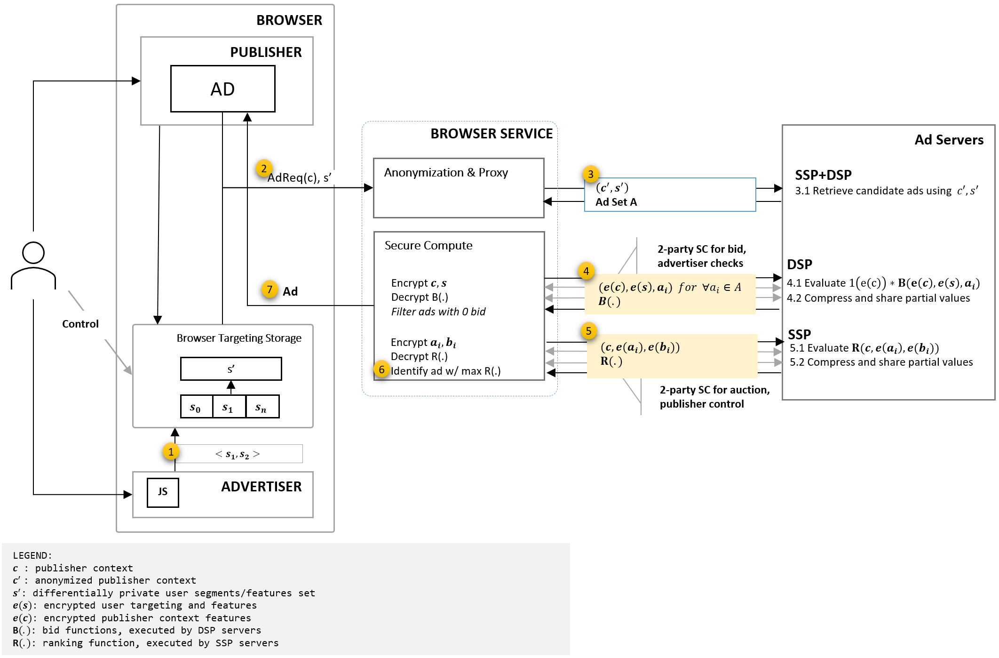

# MaCAW

This document is intended as a starting point for engaging the community and standards bodies in developing collaborative solutions fit for standardization.

Feedback is welcome in the form of github issues and via discussions in existing forums currently discussing proposals related to web advertising. Our goal is to make this publication a dynamic document that reflects feedback that we receive. If you have questions about how or where to provide feedback, please contact us at web-ads-privacy@microsoft.com.

## Table of Contents
- [MaCAW](#macaw)
  - [Table of Contents](#table-of-contents)
  - [Overview](#overview)
  - [Use cases](#use-cases)
  - [API flow for ad serving](#api-flow-for-ad-serving)
    - [Privacy-preserving ad request](#privacy-preserving-ad-request)
    - [Generalized secure compute for bid models and the ad auction](#generalized-secure-compute-for-bid-models-and-the-ad-auction)
      - [Bid function](#bid-function)
      - [Auction function](#auction-function)
  - [Secure compute protocols for generalized ML inference](#secure-compute-protocols-for-generalized-ml-inference)
      - [High-level overview of secure two-party computation (2PC)](#high-level-overview-of-secure-two-party-computation-2pc)
      - [Generating secure 2PC protocols](#generating-secure-2pc-protocols)
      - [Performance estimates of 2PC](#performance-estimates-of-2pc)
        - [Performance of linear/logisitic regression using EzPC/CrypTFlow (4 threads, 32-bit)](#performance-of-linearlogisitic-regression-using-ezpccryptflow-4-threads-32-bit)
      - [2PC for other specific functions](#2pc-for-other-specific-functions)
  - [Privacy analysis](#privacy-analysis)
  - [Other considerations](#other-considerations)
    - [Model selection and training](#model-selection-and-training)
    - [User device compute for the browser service](#user-device-compute-for-the-browser-service)
    - [Reporting](#reporting)
  - [Relation to other proposals](#relation-to-other-proposals)
    - [Dovekey auction using secure compute](#dovekey-auction-using-secure-compute)
    - [Gatekeeper server in SPARROW](#gatekeeper-server-in-sparrow)
  - [Open Questions](#open-questions)
    - [Number of rounds of communication and bandwidth](#number-of-rounds-of-communication-and-bandwidth)
    - [Partial encryption for user features or model parameters](#partial-encryption-for-user-features-or-model-parameters)

## Overview
In the PARAKEET proposal, we shared a privacy-preserving web monetization model. That proposal leverages anonymized and differentially private ad requests to preserve the privacy of individual users while still providing critical information, such as publisher context and user features, to enable ad servers to optimize ad serving. We also proposed the use of measurable privacy parameters, describing a trade-off for reasonable monetization, by restricting the granularity of contextual signals _`c`_ and reducing the granularity of user features _`s`_ to make it difficult for any participant in the system to map a specific ad request to a specific user.

Because of the user privacy protections PARAKEET introduces, the proposal limits the evaluation accuracy various ad functions such as brand safety checks that in today's systems leverages detailed publisher context _c_ and bid and ranking models that leverage context and user features _`(c, s)`_ together.

In this proposal, **M**ulti-p**a**rty **C**omputation of **A**ds on the **W**eb (MaCAW), we propose a framework to overcome these limitations by using [secure computation]( https://en.wikipedia.org/wiki/Secure_multi-party_computation) constructs. We propose a generic ad serving flow which retains the measurable privacy guarantees introduced in PARAKEET and extends the functionality with support for more comprehensive and accurate ad targeting without revealing additional user information to the ad services. Additionally, in this model the ad services do not need to share bid models, model parameters, or auction functions with the browser service; these are often considered confidential intellectual property and, as a result, it reduces the level of trust they need to extend to the browser service.

## Use cases
Ad servers play a critical role in web monetization by serving optimal and relevant ads based on the publisher context and user features. The serving logic includes ad retrieval, relevance computation, bid inference, click propensity, advertiser brand safety checks, and support for publisher quality controls using proprietary logic and machine learning models. These functions require accurate publisher context _c_ to describe the placement of the ad and user features _s_ representing user interests and affinities. Providing accurate, unmodified request parameters _`(c, s)`_ provides increased relevance and monetization potential but unfortunately greatly increases joinability risks and the associated privacy impacts.

The PARAKEET proposal describes an ad request flow using an anonymized context and differentially-private user features _`(c', s')`_. This provides improvements to user privacy; however, it has an impact on the accuracy of ad server logic. We propose additional steps in the request flow using secure computation to support the following use cases using accurate context and user features _`(c, s)`_:
1. Bid model: a machine learning model that evaluates the advertiser bid value at request time using _`(c, s)`_.  In some cases, the DSP may need accurate context and segment information to assess the value of the impression and return their optimal bid. Secure computation as an optional second step allows the DSP to choose to optimize/update the bid for that impression if they find the initial c' and s' was insufficient. Certain publisher context or advertiser segments may be considered to be of high value by the DSP, and they may want to get more accurate information when deciding the optimal bid.

2. Brand safety checks: advertiser-required restrictions based on publisher context _`c`_. Brand safety in advertising is the function by which brands can ensure that their ads show in safe environments. For example, an airline advertiser may not want to show their ads next to an article about the spread of a pandemic. The SSP or the DSP can optionally request the secure computation option wherein they can run brand safety model on an accurate but encrypted _`c`_ and _`s`_, such that they retain the model parameters for themselves (not sharing with third parties such as the browser vendor running the PARAKEET service) and never actually observe the true _`c`_ and _`s`_.

3. Ranking function: composite function using relevance, click propensity, bid value, and auction parameters. The DSP or the publisher/SSP may want to request access to bids and ads in order to optimize their auction. The publisher's goal is to maximize yield for their traffic while maintaining user experience and value, while the DSP wants to maximize the likelihood of showing the right ad to the right user. Either party can make a second request to optimize their respective auction.  

4. Publisher controls: publisher specific check on the "quality" of the ad. Publishers may want to prevent certain classes of ads from being shown on their pages because they consider the ad to be low quality. For example: the ad may be considered misleading or fraudulent; the ad may be considered hate speech; or the ad may involve a product not appropriate for their audience (e.g. alcohol or tobacco). In these situations, the publisher or SSP may want to request access to granular ad information. This can be enabled by a second secure compute operation after the initial set of ads are received.

We propose a two-step serving setup. The first step leverages anonymized and differentially private ad requests, _`c'`_ and _`s'`_, to identify a set of ad candidates. The second step securely evaluates an accurate function on _`(encrypted(c), encrypted(s), ad)`_ using a secure multi-party computation ([MPC]( https://en.wikipedia.org/wiki/Secure_multi-party_computation)) algorithm. Please note that when we use the term "encrypted" to denote values that are hidden, we mean that these values are hidden using a cryptographic construct known as [secret sharing](https://en.wikipedia.org/wiki/Secret_sharing).

## API flow for ad serving
The following diagram shows the ad serving data flow and high-level API details:


### Privacy-preserving ad request
The detailed API flow for the privacy preserving ad request can be found in the [PARAKEET](https://github.com/WICG/privacy-preserving-ads/blob/main/Parakeet.md#api-flow-for-ad-serving) proposal. The first step in this proposal leverages the same setup. The service first reduces granularity and anonymizes publisher context _`c`_ using occurrence statistics within the time epoch and then proxies the ad request. The service also provides differentially private user features _`s'`_ with the anonymized ad request. Ad servers can then leverage the request information _`(c',s')`_ to retrieve and rank the candidate ads. We are further extending the proposal so the ad server can choose to participate in secure compute for each ad in the ad set with the following response construct.
```
const adResponse = {
    'ads': [{
      creative-id: 'hashid'
      creative: 'https://ad-creative.cdn',
      bid-inference-origin: 'https://dsp.example',
      bid-model-format: 'https://dsp.example/bidmodel-structure-for-service.out',
      contextual-signal-processor: 'https://dsp.example/feature-processing.js'
      fallback-bid: 1.00,
      lang: 'en-us',
      adtype: 'image/native'
      },
    ],
    auction-inference-origin: 'https://ssp.ad-network.example',
    auction-model-format: 'https://dsp.example/rankingmodel-structure-for-service.out',
    fallback-ranking: 'highest-bid'
    ad-signal-processor: 'https://ssp.example/feature-processing.js'
    ranking-signals: ['coarse-geolocation', 'coarse-ua', 'encrypted-ad', 'encrypted-bid']
};
```
In this example, the meanings of the ad response parameters are:
* `ads`: Set of candidate ads for the request
* `creative-id` : unique ad id for DSP server to uniquely identify an ad
* `creative` : URL for loading the creative from
* `bid-inference-origin`: DSP server endpoint to be used for secure compute for bid and brand safety check
* `bid-model-format`: compiled model structure for the browser service, note that this does not contain model parameters 
* `contextual-signal-processor`: code snippet to standardize publisher context to features for input to the bid model, provided by DSP
* `fallback-bid`: default bid value to be used for inference timeout or failure
* `lang`: language that the ad is relevant for
* `adtype`: ad type (native, display, video, ...), field to declare type of ad for creative rendering
* `auction-inference-origin`: SSP server endpoint to be used for secure compute for ranking and auction
* `auction-model-format`: compiled auction model structure for the browser service, composite function of ad quality, click probabilities and auction parameters
* `fallback-ranking`: fallback auction logic for timeouts or failures, for example, highest-bid, direct-sold, house-ad
* `ad-signal-processor`: code snippet to standardize ad features for input to the ranking and publisher control models, provided by SSP
* `ranking-signals`: ranking signals to be provided in addition to context, encrypted ad and encrypted bid, such as coarse geo-location, device etc.

The next section depicts how this response is used in the secure compute steps between the browser service and ad servers.

### Generalized secure compute for bid models and the ad auction
Ad servers can opt into participating in secure compute, specifying their service endpoint and model details. The service will use this information to initiate model inference. For simplicity, we describe two inferences: a bid function **_`B(e(c),e(s),ad)`_** with a DSP endpoint and a ranking model **_`R(c,e(s),e(bid),e(ad))`_** for a SSP endpoint. Without a loss of generality, one can extend the bid function construct with an additional binary model for brand safety check as **_`1(e(c))B(e(c),e(s),ad)`_**, where **_`1(e(c))`_** is the brand safety check. Similarly, a ranking model can be represented as a composite function of click, relevance, and a binary model for publisher controls.

#### Bid function
The browser service preprocesses publisher context _c_ specified in the contextual signal logic, retrieves the user features based on the DSP's read permission, and encrypts the two feature sets before starting the inference. These encrypted features will be used by the service to go through secure computation, where the compute is a multi-step evaluation performed jointly by the browser service and the DSP service endpoint, as explained in the protocols section. At the end of the bid inference steps, the service knows the precise bid value without learning about the bid model parameters while the DSP server learns no information about the true _`(c,s)`_.

#### Auction function 
Similar to the bid function, the browser service works with a SSP server to compute the auction ranking for the ads with non-zero bids, where the browser service provides _`c,e(ad),e(bid)`_ for each ad. The SSP server can evaluate the publisher controls on ad creatives using same secure compute flow. At the conclusion of the ranking computation, the service decrypts the result, learns the ranked set of ads, and selects one or more ads to render in a _Fenced Frame_ based on the ad request or ad creative configurations.

In most cases, both of the above steps need a combination of machine learning inference and/or dictionary-based dot product. Latency and compute requirements for these inferences primarily depend on the choice of the models, the size of the feature set, the function complexity, and the network latency. The next section details a generalized machine learning and deep learning inference setup in secure compute setup and explains the method for example functions such as logisitic and linear functions. We provide a strawman proposal for secure compute serving for the browser service and ad servers as well as a compiler reference to support independent evaluation of current models. 

## Secure compute protocols for generalized ML inference
#### High-level overview of secure two-party computation (2PC)
Computing the **_`B(.)`_** and **_`R(.)`_** functions are specific instances of secure inference based on secure two-party computation (2PC).

The input of the DSP/SSP is the model parameters _`w`_, while the inputs of the browser service are publisher context _`c`_ and user features _`s`_. Secure computation will ensure that the values _`c`_, and _`s`_ are hidden from the DSP/SSP, the value _`w`_ is hidden from the browser service, and the browser service will be the only entity to observe output of these functions.

Secure two-party computation protocols typically convert the computation of the function into an interactive protocol where both parties compute over secret shares of the private values. The secret shares of a 32-bit value _x_ are random 32 bit values _`x0`_ and _`x1`_, subject to the constraint that _`x0 + x1 = x`_, where `+` denotes addition in the ring _`Z mod 2^{32}`_. 

At a very high level, the computation (over 32-bit secrets) then continues with the following steps:
1) Each party will send one of the secret shares of its input to the other party, while retaining the other share. In our example, the DSP will send _`w0`_ to the browser service while retaining _`w1 = w - w0`_. Similarly, the browser service will send _`c1`_ and _`s1`_ to the ad network while retaining _`c0`_ and _`s0`_. The common public information _`ad`_ is known to both parties.
2) For any function _`G`_, the 2 parties (DSP and browser service) will run an interactive protocol that takes shares of inputs _`w`_, _`c`_, and _`s`_ and gives out shares of the output of _`G(w,c,s)`_ to both parties. 

Such protocols are known for various types of functions. For example, if _`G`_ were the addition operation _`G(w,c,s) = w+c+s`_, we can observe that both parties can simply add their local shares to obtain shares of the output (i.e., the ad network sets its output to _`w1+c1+s1`_, while the browser service will set its output to _`w0+c0+s0`_. Protocols for other basic operations such as multiplication, comparisons, and almost any other operation are known but require more complex operations and interaction.

One can sequentially execute protocols for the required operations to compute an end-to-end protocol that computes shares of _**`b = B(w,c,s,ad)`**_. Once the 2 parties hold shares of the output, the relevant party can learn the output in the clear by "reconstructing" the shares. In our example, the DSP can send its share _`b1`_ to the browser service which can combine it with _`b0`_ to learn the value of _`b`_ in the clear.
#### Generating secure 2PC protocols
Generating secure computation protocols for **_`B(w,c,s,ad)`_** can be done using the [CrypTFlow](https://www.microsoft.com/en-us/research/publication/cryptflow-secure-tensorflow-inference/) system by expressing **_`B`_** in TensorFlow or ONNX or C-like language [EzPC](https://www.microsoft.com/en-us/research/project/ezpc-easy-secure-multi-party-computation/). The CrypTFlow system takes as input standard TensorFlow/ONNX code and only requires the developer to specify which party holds features and model parameters. The functional form or model architecture is common knowledge of both the parties. The CrypTFlow framework can then be used to auto-generate secure two-party inference protocols for computing the function. The function __*`R(.)`*__ can be calculated in a similar manner to __*`B(.)`*__. Secure inference protocols provably do not leak any information other than the output of the function to either party.

The [CrypTFlow paper](https://www.microsoft.com/en-us/research/uploads/prod/2020/08/CrypTFlow2.pdf) explains the algorithm, implementation, and computational complexity in detail. To ease the model development process, we explain the setup using the following three steps; we will continue to enhance development tools and explore standardization.

1. Model training: in this proposal, we assume that ad servers have trained a model which needs to be used for serve-time inference. Without loss of generality, we assume that the model can be represented in TensorFlow format. Let's consider a trained TensorFlow model which does logistic regression for ranking:
    ```
    # User features of length m
    x = tf.placeholder(tf.float32, [m], name="features")

    # Model parameters. Ranking n ads.
    W = tf.Variable(tf.constant(0.1, shape=[m, n]))
    b = tf.Variable(tf.constant(0.2, shape=[n]))

    # Inference model
    pred = tf.argmax(tf.matmul(x, W) + b, name="output")
    ```

    This model is saved as a Tensorflow protobuf in model.pb.

2. MPC setup Ad server:
    ```
    python path/to/EzPC/Athos/CompileTFGraph.py --config config.json --role server
    where, config is
    {
      "model_name": "model.pb",  // model file in ONNX or TensorFlow format
      "input_tensors": { "features" : "100"}, // name of input features/nodes (m=100)
      "target": "SCI", // secure 2PC backend
      "scale": 12, // scaling factor for floating to fixed point conversion tuned for the model by ad server
      "output_tensors": [ "output"] //name of output nodes
    }
    outputs 
    { 
      model.out, // compiled MPC code for the model
      model.weights, // model parameters in fixed point
      client.zip // pruned model structure and metadata for the browser service to execute protocol
    }
    ```

    The ad server (DSP or SSP) will host the `model.out` MPC logic and send the model (without weights) to the browser service in client.zip along with some other metadata.

3. MPC setup for browser service:
    ``` 
    python path/to/EzPC/Athos/CompileTFGraph.py --config config.json --role client
    where, 
    config.json is extracted from client.zip prepared by ad server
    outputs
    {
      model.out // compiled MPC code for the model to be run by the browser service
    }
    ```

    The browser service will host the compiled MPC logic for the model to execute inference at serve time. Additionally, the browser service will convert user features to fixed point with the specified scale in config.json. 

At this point, the ad server and the browser service can now jointly do the secure computation of ranking. The ad server will feed the model weights (fixed point) as an input to the protocol on its side, and the browser service will feed the user features (fixed point) on its side. The output of this ranking function will be revealed only to the browser service.

We can also compile general purpose code written in the EzPC language. Consider a ranking function that does a Hadamard-product of two vectors and then returns the top 10 results. For example, EzPC code for this would look like this:
```
def void ElemWiseMul(int32_pl size, int64_al[size] A, int64_al[size] B, int64_al[size] Output) {
  for i=[0:size] {
    Output[i] = A[i] * B [i];
  };
}

def void BubbleSortAndTop10(int32_pl size, int64_al[size] A) {
 for t=[0:10] {
   for i=[1:size] {
     int32_pl idx = size - i;
     int64_al tmp = (A[idx] < A[idx-1]) ? A[idx] : A[idx-1];
     A[idx] = (A[idx] < A[idx-1]) ? A[idx-1] : A[idx];
     A[idx-1] = (tmp < A[idx-1]) ? tmp : A[idx-1];
   };
 };
}

def void main() {
  input(CLIENT, A, int64_al[40]);  (*Browser Service*)
  input(SERVER, B, int64_al[40]);  (*Ad Service*)
  
  int64_al[40] Mul;
  ElemWiseMul(40, A, B, Mul);

  int64_al[10] Output;
  BubbleSortAndTop10(40, Mul);
  for i=[0:10] {
    Output[i] = Mul[i];
  };

  output(CLIENT, Output); (*Browser Service*)
}
```

As in the case of model inference (where the model without weights was shared) this code can be shared with the browser service and both servers can compile it with the [EzPC compiler](https://github.com/mpc-msri/EzPC/tree/master/EzPC) and then run the generated MPC protocol.

We provide open source code for the compiler at [GitHub's EzPC Repository](https://github.com/mpc-msri/EzPC) and detailed reference material on the [EzPC site](https://www.microsoft.com/en-us/research/project/ezpc-easy-secure-multi-party-computation/). We are exploring making the browser service code open source for the community to both to contribute to as well as to independently inspect to build trust.

Please note that the current EzPC compiler allows data to be output on the server side via an explicit call to `output(SERVER, ...)` in order to enable a generic 2PC protocol. The output of 2PC programs in our proposal could be privacy sensitive, so we will prevent the usage of the `output` construct on the ad server side.
#### Performance estimates of 2PC
As can be observed from the above description, the overhead of 2PC protocols grow with the function complexity.

At the lowest level, addition operations are the cheapest (with no interaction or communication), while multiplications are a bit more expensive (costing 2 rounds of interaction and communication).

Comparisons (which are the basis for several non-linear activation functions in neural networks) cost more. As an example, when performing the secure computation of linear regression, **`W`**<sub>`n1xn2`</sub>`*` **`x`**<sub>`n2x1`</sub>`+`**`b`**<sub>`n2x1`</sub> (where _`n1`_ and _`n2`_ are dimensions) over 32-bit integers, the total communication required is approximately _`4608 x n1 x n2 + 4992 x n2`_ bits and 10 rounds of interaction. During secure inference, linear and logistic regression are equivalent since we can apply the sigmoid locally on the final output of the linear regression. Basic benchmarks for the performance of linear/logistic regression when executed with the EzPC/CrypTFlow system are provided below. We set the input size `n1=n2=N` and measure performance for different values of `N`.

##### Performance of linear/logisitic regression using EzPC/CrypTFlow (4 threads, 32-bit)
| N    | Time (ms) | Total Comm (MiB) | Peak Mem Server (MiB) | Peak Mem Client (MiB) |
|------|-----------|------------------|----------------------|----------------------|
| 400  | 201       | 51.4645          | 65.73                | 50.89                |
| 1600 | 2585      | 804.732          | 693.43               | 378.01               |
| 3200 | 9913      | 3215.76          | 2654.21              | 1365.53              |

#### 2PC for other specific functions
While the CrypTFlow framework can be used to generate secure 2PC protocols for neural network algorithms, the EzPC framework can be used for more general functions (e.g. secure auctions and non-neural network ML algorithms such as decision trees or random forests). Certain functions can also benefit from more specialized secure computation protocols. One example is that of membership testing: in this setting, the browser service has a list of keywords while the ad network has a large dictionary. The goal is to securely determine whether one of the keywords is present in the dictionary or not. While the EzPC framework can be used to generate protocols for this function, one can obtain larger benefits in performance by building specialized protocols for these functions based on works on private set intersection (see [PSZ18](https://dl.acm.org/doi/pdf/10.1145/3154794), [KLSAP17](https://eprint.iacr.org/2017/670.pdf), [CLR17](https://eprint.iacr.org/2017/299.pdf), [CGS21](https://eprint.iacr.org/2021/034.pdf)).

## Privacy analysis
This proposal extends the PARAKEET proposal with additional steps for private and accurate inferences for bid and auction functions. These inferences are executed using secure compute with cryptographic guarantees by browser service without any potentially personally-identifiable information such as IP or geolocation information. The privacy parameters proposed by PARAKEET remain the same even with the more accurate evaluation.

## Other considerations
### Model selection and training
Model selection is an important consideration for latency and compute cost. Ad servers can leverage various functional representations for bid and ranking inference and are expected to continue evaluating latency vs. accuracy trade-offs. The browser service will also continue to enhance generalized inference and support for related ad function evaluations via secure compute. We will continue to optimize specific use cases such as brand safety checks.

Model training is out of scope for this proposal but we anticipate that ad servers can leverage aggregate reporting to collect required training examples. We understand that noised training data could have an impact on model accuracy and performance. Future proposals may suggest techniques for enhancing model training via secure compute and differentially private gradient computation.

### User device compute for the browser service 
We are not currently developing proposals that directly leverage the users' browser for computation related to ad serving. Due to the need to evaluate hundreds of ads per ad impression, we believe that meeting acceptable goals on the impact to client bandwidth and device resources would necessitate too many restrictions for effective ad servicing and subsequent monetization. Instead, we believe that the browser service is currently better positioned to handle this workload. We will continue to look for optimization opportunities that allow reducing the role of the browser service in the future. Additionally, we believe there is possibly a model where a three-party secure compute system, where the browser service participates in reducing computation complexity, without needing to obtain user or ad information.

### Reporting
We propose to leverage similar approach to [aggregated measurement](https://github.com/WICG/conversion-measurement-api/blob/main/AGGREGATE.md) for reporting. We will share additional details and enhancements in future proposals for reporting.


## Relation to other proposals
### Dovekey auction using secure compute
[Dovekey Secure Compute](https://github.com/google/ads-privacy/blob/master/proposals/dovekey/dovekey_auction_secure_2pc.md) describes a construct which leverages two-party secure computation to evaluate auction eligibility of cached bids or bid candidates and to run the auction logic. The proposal explains a setup where two non-colluding servers work together to compute a bid by using a dot product on **_`c`_ (or _`v(contextual)`_)** and **_`W`_ (or _`v(bid)`_)** using custom protocols. One can think of the Dovekey server auction and bid compute logic as a special case of the secure compute setup described here in MaCAW which uses helper servers to run the logic, with secret sharing of user features and ad server business logic. The primary specialization in the Dovekey 2PC server auction involves a set of predefined bid and auction logic in order to enable providing secret shares to two non-colluding servers that help enable serving. In this design, we propose a generic 2PC setup where the browser service protects user data and ad servers keep private their ad inventory, model parameters and other business confidential information, working together to serve private, relevant, and optimized results. 

### Gatekeeper server in SPARROW
[SPARROW](https://github.com/WICG/sparrow) describes a server-based model where DSPs leverage, but do not own or run, a trusted server ("the Gatekeeper") to run models. It proposes to retrieve interest-based ads, with bids based on user features and page contextual data. Our proposal's accurate bid computation step is inspired by the Gatekeeper server. The key difference is that we propose to use encrypted input features to bid models, allowing us to eliminate the need of the trusted server to fully host bid models. We also describe a similar contruct for running an auction with SSPs.  

## Open Questions
### Number of rounds of communication and bandwidth 
We proposed a generic secure compute-based setup for DSP bid functions and SSP auction which requires a significant number of rounds of communication between the browser service and ad servers. Careful consideration is needed for the design of the hosting model to optimize for communication latency and bandwidth in very large query per second setups such as web advertising.

### Partial encryption for user features or model parameters 
Current proposal assumes encryption of `<contextual information, user features>` and model parameters. Partially revealing values could reduce protocol cost and should be explored further.

[Open a new issue](https://github.com/WICG/privacy-preserving-ads/issues/new?labels=MaCAW&template=MACAW.md&title=%MaCAW%5D+%3CTITLE+HERE%3E)

See open GitHub Issues: <a href="https://github.com/WICG/privacy-preserving-ads/labels/MaCAW">
    </a> |
