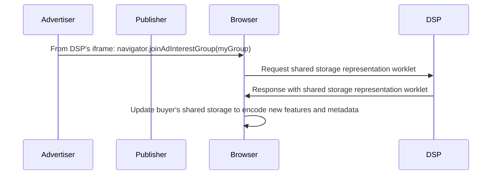
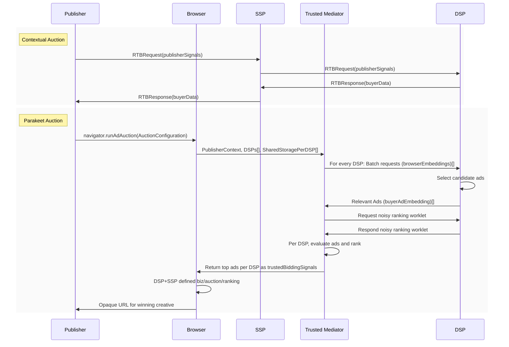
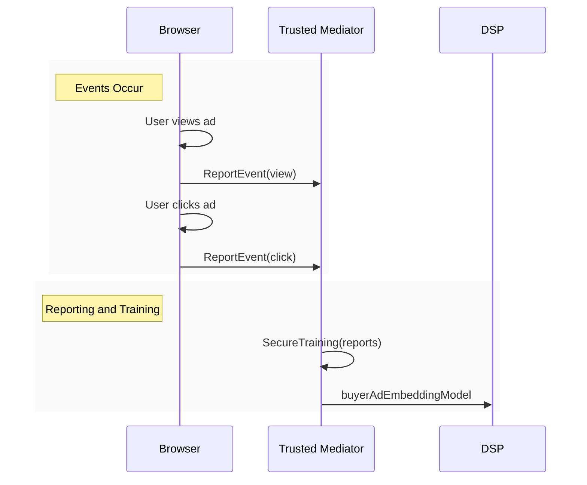

# Introduction

In today's web advertising ecosystem, demand-side platforms (DSPs) and advertising networks rely heavily on cross-site, fine-grained user tracking signals to match relevant ads to users' interests.  This violates many users' expectation of privacy, because a wide range of entities can uniquely identify a user's footprints across the web, including what articles they view and what products they search for, to build a persistent profile of the user.

Through this proposal, we aim to replace the current mechanisms that depend on cross-site profile building with a new workflow that preserves both user privacy and ad relevance.  Our approach makes two key assumptions.  The first is that user history and ad signals can be represented as low dimensional embeddings with the property that the ad-user relevance ranking can be summarized by the [inner product](https://en.wikipedia.org/wiki/Dot_product) between the user and ad embeddings.  This requires a *mapping*, or *model*, between sparse high-dimensional fine-grained user data and ad information into a more concise low-dimensional embedding space.  The second assumption is the existence of a *mediator*, trusted by the user agent, that is responsible for ensuring only anonymized signals are released to other parties, including DSPs and advertising networks.  This trusted mediator service maintains the mappings between private, highly sensitive user information and the low dimensional embedding space.  The mediator performs a number of additional tasks on behalf of the DSPs and users, including:

* Providing a *noisy* user representation to ad buyers for ad selection
* Performing a final ranking of ads provided by buyers
* Creating and maintaining the mapping between raw user and ad signals into a low dimensional embedding space

Critically, by restricting our ranking function to this inner product space, we can ensure detailed user information is provably private while still returning relevant ad results from ad buyers.  The trusted mediator can then use the true user vector to compare ads provided by the buyers to perform a final ranking.

This proposal, _PARAKEET with Noisy Ranking_, supersedes the original [PARAKEET](https://github.com/WICG/privacy-preserving-ads/blob/main/Parakeet.md) (Private and Anonymized Requests for Ads that Keep Efficacy and Enhance Transparency) proposal.

- [Introduction](#introduction)
- [Parties and Actions](#parties-and-actions)
- [PARAKEET with Noisy Ranking vs. original PARAKEET](#parakeet-with-noisy-ranking-vs-original-parakeet)
  - [Embeddings](#embeddings)
- [Noisy Ranking](#noisy-ranking)
- [API Shape](#api-shape)
- [Global Setup](#global-setup)
  - [Models](#models)
  - [Feature Representation](#feature-representation)
- [Signals Collected Pre-Auction](#signals-collected-pre-auction)
  - [Advertiser Data and Feature Representations](#advertiser-data-and-feature-representations)
- [Auction](#auction)
  - [Publisher Data and OpenRTB Requests](#publisher-data-and-openrtb-requests)
  - [Publisher Data and OpenRTB Response](#publisher-data-and-openrtb-response)
  - [Browser to Trusted Mediator](#browser-to-trusted-mediator)
  - [Trusted Mediator to Buyers](#trusted-mediator-to-buyers)
  - [Trusted Mediator Evaluates Buyer Auction Logic and Retargeting](#trusted-mediator-evaluates-buyer-auction-logic-and-retargeting)
  - [Browser insertion into Auction environment](#browser-insertion-into-auction-environment)
- [Event Reporting](#event-reporting)
- [Example Model Representation](#example-model-representation)
- [Privacy Considerations](#privacy-considerations)
  - [Differential Privacy, Batching, and Caching](#differential-privacy-batching-and-caching)
  - [Core Concern: Differentially Private Embeddings in Batches](#core-concern-differentially-private-embeddings-in-batches)
    - [Noisy Batches](#noisy-batches)
  - [Core Concern: Multiple Requests for the Same User](#core-concern-multiple-requests-for-the-same-user)
    - [Throttled Requests](#throttled-requests)
    - [Random Delays](#random-delays)
    - [Caching](#caching)
  - [Additional Safeguards](#additional-safeguards)
  - [Multiple DSPs within a Single Trusted Mediator](#multiple-dsps-within-a-single-trusted-mediator)
  - [Limited Coarse Signals](#limited-coarse-signals)
- [Further Details](#further-details)
  - [Training](#training)
  - [Proof of Noisy Request Bound](#proof-of-noisy-request-bound)
- [Release Stages](#release-stages)

# Parties and Actions
There are a number of parties involved in the modern advertising ecosystem, each of which will need to adjust to integrate with the proposed noisy ranking workflow.  We introduce, at a high level, the most impacted parties below.

* Advertiser: The website interested in buying an ad to display to a user.  The advertiser is most interested in supplying relevant advertisements to the user. 
  * PARAKEET with Noisy Ranking extends the [FLEDGE](https://github.com/WICG/turtledove/blob/main/FLEDGE.md) framework for advertisers by requiring an additional `enableSharedStorageWorklet` flag to be set in the object passed to the `joinAdInterestGroup` call that runs in an iframe in the owner's domain.  This should largely be an uncomplicated change for advertisers, as in most situations ad-tech will likely be providing advertisers a script. See [Signals Collected Pre-Auction](#signals-collected-pre-auction) for more details.
* Publisher: The website selling an ad slot on a page.  These often work with a SSP and variety of buyers to find ads for the page.  
  * The publisher will likely be provided a script from their SSP to run a FLEDGE / PARAKEET V2 auction.
* User Agent: Often referred to as a browser, this entity represents a user's interaction with other parties.  It provides a set of APIs for publishers and advertisers to pass relevant user information onto the Trusted Mediator and request ads.  It also provides a unique ID (which can be reset by the user) to the trusted mediator service with each update of information and each ad request.
  * Browsers must check for the `enableSharedStorageWorklet` flag to be set within a buyer's iframe, and call the corresponding worklets from a well-known URL.  See [Signals Collected Pre-Auction](#signals-collected-pre-auction) for more details.
  * There are considerable changes required by browser vendors for FLEDGE auctions, but bootstrapping this proposal (PARAKEET with Noisy Ranking) into a FLEDGE/TURTLEDOVE auction should require minimal additional changes.  Primarily, the work involves additional calls to PARAKEET Trusted Mediators; see [Browser to Trusted Mediator](#browser-to-trusted-mediator) for more details.
* Trusted Mediator: A service that handles cross-site data (and ranking) between the publisher, the browser, and the buyer/advertising service.  This explainer does not define the trust mechanisms of the trusted service, but could include trusted hardware, code audits, third-party companies, and/or addditional to-be-determined mechanisms.  The trusted mediator is the only service allowed access to browser's unique user ID.
* Buyer: Handles the demand side (i.e., finds ads) by communicating with various advertising services.  Handles selection of ads based on a noisy ranking vector, returning ad creatives and other metadata (e.g. bids) to the trusted mediator for a final ranking. The buyer is often, but not always, a DSP (demand service platform).
    * There is a considerable amount of API surface area created by the FLEDGE proposal; PARAKEET with Noisy Ranking extends these base primitives and surface area allowing minimal effort for both mechanisms to be implemented.
    * PARAKEET with Noisy Ranking relies on a *embedding* representation for buyer ad selection.  See the subsequent sections for more details.

# PARAKEET with Noisy Ranking vs. original PARAKEET
In the original [PARAKEET proposal](https://github.com/WICG/privacy-preserving-ads/blob/main/Parakeet.md), the trusted service is responsible for anonymizing the contextual signals of an ad request as well as a user's cross-domain ad interests (represented as a sparse vector of interest group identifiers).  It subsequently handled proxying those signals to ad-tech. Privacy is achieved through the clustering of ad-interest vectors, and picking a true or false cluster centroid for an incoming user according to a parameter that tunes the balance between utility and privacy. This approach to anonymization made the trusted service responsible for balancing the privacy of the user against the utility of the ad selection signals-- two seemingly contradictory goals. In practice, we found the best approach for clustering involved an intermediate conversion into a learned, dense, low-dimensional [*embedding* space](https://medium.com/mlearning-ai/country-prediction-using-word-embedding-f5c0f930c87b). An anonymized centroid was then cast back up to the raw, sparse signals and passed off to ad-tech.

This updated proposal gives ad-tech control of the model representation that converts sparse signals into a the learned embedding vector.  The trusted mediator is now charged with mapping the sparse signals into an ad-tech's preferred low dimensional space (using the ad-tech provided representation), anonymizing it, and passing the anonymized vector to the ad-tech for ad selection.  By restricting the norm of the vector and the ranking function, the trusted mediator is capable of both enforcing [differential privacy](#differential-privacy-batching-and-caching) on the vector and [bounding the error](#proof-of-noisy-request-bound) of the noisy vector's ranking.


## Embeddings
Where the original PARAKEET proposal focused on sending raw-yet-anonymized signals to buyers, in PARAKEET with Noisy Ranking we shift to sending an *embedding* vector instead.  An embedding is a dense, low dimensional representation of the high dimensional feature space.  For example, if we start with a sparse categorical attribute (like gender, income, area code etc.) it can successfully be represented with a small dense vector of real numbers, e.g., 
```
5.4,-3.2,0.1 ... -2.3
```
Despite the simplicity of the final representation, embeddings have been used with great success for summarizing text, images or speech, with many practical applications deployed at scale today.  Intuitively, embeddings *summarize* the high dimensional space into a more manageable representation, carrying with them reasonable notions of distance and similarity.  A classic example is the types of intuitive operations that can be done in the space: the embedding for *Germany* can [be estimated](https://medium.com/mlearning-ai/country-prediction-using-word-embedding-f5c0f930c87b) utilizing the relationships between countries and capitals.  More precisely, given the embeddings for *Spain*, *Madrid* and *Berlin* we can derive the embedding for *Germany* like so:

```
emb(Spain) + (emb(Berlin) - emb(Madrid)) = emb(Germany)
```
  
Return to the ad relevance domain, by mapping every ad to a corresponding `buyerAdEmbedding`, we can **rank** their relevance to a corresponding user's `browserEmbedding` by taking the [inner product](https://en.wikipedia.org/wiki/Inner_product_space).  The ad most similar to the user will maximize this computation.  

There are many additional useful properties of embeddings, the most important is that they are [well studied](https://developers.google.com/machine-learning/crash-course/embeddings/video-lecture) both for [training](https://en.wikipedia.org/wiki/Word_embedding) and for efficiently [retrieving nearby items](https://towardsdatascience.com/comprehensive-guide-to-approximate-nearest-neighbors-algorithms-8b94f057d6b6) which maximize the above inner products.

# Noisy Ranking
Rather than using the raw embedding for retrieval, the core piece of the proposal centers on the notion of a *noisy* ranking function.  For this ranking function, we invoke the following assumption:

**Ranking Assumption:** The function used to match a user and an ad is defined via an [inner product](https://en.wikipedia.org/wiki/Inner_product_space) in some embedding space. That is, given user-side `browserEmbedding` C and ad-side `buyerAdEmbedding` S<sub>i</sub>, the ad chosen is the one that maximizes the inner product C &sdot; S<sub>i</sub>.

Although the interaction between user signals and ad signals is constrained to a linear function, we allow for the existence of a *mapping* between fine-grained user information (or ad information) into a dense, low dimensional embedding space.  The core of the algorithm uses two mappings that are tied to (and provided by) a specific buyer:
* C := &#928;<sub>p</sub>(*User Historical Signals*, *Publisher Context*), is a condensed representation of user history (e.g., previous URLs visited) and current publisher signal(current URL topic),
* S := &#928;<sub>a</sub>(*Ad Signals*) is a condensed representation of an ad (e.g., Advertiser eTLD+1, AdTitle).  Any mapping updates must be also shared with a buyer.

The Trusted Mediator holds both &#928;<sub>p</sub> and &#928;<sub>a</sub>, training them using privacy-preserving techniques and sharing &#928;<sub>a</sub> with the corresponding buyer.  When an ad request comes in the Trusted Mediator performs the *Noisy Ranking* algorithm:
1. Perform the mapping &#928;<sub>p</sub>(*User History Signals*, *Publisher Context*) &rightarrow; C (or `browserEmbedding`) since only the Trusted Mediator is privy to these signals.
2. Add noise to C to obtain: C + &theta; -> C<sup>'</sup>.  Here &theta; is a random vector of noise intended to anonymize fine grained user signals.
3. Pass the noisy representation C<sup>'</sup> to the corresponding buyer.
4. Collect all ads' `buyerAdEmbedding` A<sup>t</sup> from the buyer.
5. Evaluate the true ranking function C &sdot; S<sub>t</sub> (not using the noisy C), and choose the winner. 

After choosing the winning ads, the Trusted Mediator returns the winners from each buyer to the browser, after which the auction runs as usual.

We now present some further API details.

# API Shape
The proposed API shape extends the **navigator.joinAdInterestGroup(group, duration)** and **navigator.runAdAuction(auctionConfig)** proposed in FLEDGE [joining interest groups](https://github.com/WICG/turtledove/blob/main/FLEDGE.md#11-joining-interest-groups) and [initiating an on-device auction](https://github.com/WICG/turtledove/blob/main/FLEDGE.md#21-initiating-an-on-device-auction).

**navigator.joinAdInterestGroup(group, duration)**

Used pre-auction in [Advertiser Data and Feature Representations](#advertiser-data-and-feature-representations).

Additional optional properties for `group`:
- `enableSharedStorageWorklet`: boolean  -> When present and set to true enables additional worklet flow
- `trustedMediatorSignals`: object:Any    -> Passed to shared storage worklet if present and worklet is enabled with enableSharedStorageWorklet

**navigator.runAdAuction(auctionConfig)**

Used to initiate an [Auction](#auction).

Additional optional properties for `auctionConfig`:
- `perBuyerSignals.trustedRepresentation`: TrustedRepresentation  -> When present in any perBuyerSignals will initiate a PARAKEET request flow for the specified buyer.

TrustedRepresentation:
- `version`: string -> Indicates version to model to use
- `enabled`: boolean -> Is Trusted Mediator flow + Noisy Ranking enabled for buyer
- `modelTag`: string -> Model to use
- `vectors`: object -> Key value pairs of embedding vector data to use.


## Global Setup
Some initial investment is required from various parties for them to integrate with PARAKEET.
* The buyer and trusted mediators must share a model that can be used for noisy ranking
* The buyer must develop a `shared-storage-worklet` and place at a `.well-known` URL for processing advertiser events and placing into the user's cross-site shared storage.
* The advertiser must insert the `enabledSharedStorageWorklet` flag into the FLEDGE interest group settings.

### Models
Each buyer can register a (small) fixed number of model structures with the trusted mediator and periodically request retraining of those models by the mediator. We propose the shared model format to be ONNX, a cross-platform representation designed specifically for inference, which is widely used within the industry.  Models are split into two components: a `browserEmbedding` side (representing all signals about the user, their history, and the context the ad will be placed in), and the `buyerAdEmbedding` side (representing all distilled knowledge about the ad by the buyer).  After retraining with differential privacy, the `buyerAdEmbedding` model will be shared with the buyer for them to perform ads selection when requests are presented by the mediator.  Tying into our above notation, the `browserEmbedding` model corresponds to C<sub>U</sub>, while `buyerAdEmbedding` corresponds to S<sub>t</sub>.

### Feature Representation
The user history vectors used can be expressive, and later we will discuss worklets that permit significant flexibility by a buyer to store knowledge that is expressive yet private.  The ONNX ranking models, however, expect two types of explicit representations:

```
dense-vec : val,val,val,val...
sparse-vec: index:val,index:val,index:val...
```

The mediator will translate these string representations into an ONNX sparse or dense vector representation, which will then be used to evaluate the pre-shared models.  However, the mediator does not attempt to interpret the vectors it receives.  How these vectors are created and what they represent is determined by the buyers, not the mediator.

## Signals Collected Pre-Auction
Within PARAKEET with Nosiy Ranking, the vectors sent to the trusted mediator can contain information gathered in one of two ways:
* Cross-site advertiser data is stored on the browser utilizing the [Shared Storage API](https://github.com/pythagoraskitty/shared-storage).  This representation is controlled per buyer, and is set via a worklet called by a buyer's iframe that's loaded on each advertiser's site.
* Raw publisher data is converted to the corresponding feature vectors [immediately before the auction](#publisher-data-and-openrtb-requests).

### Advertiser Data and Feature Representations

Cross-advertiser data and feature representations are controlled via a worklet provided by the buyer within the existing interest group API within the FLEDGE framework.  We extend the FLEDGE specification in the following way:

```javascript
const myGroup = {
    owner : "www.example-dsp.example", // Defined by FLEDGE
    // FLEDGE specific settings
    enableSharedStorageWorklet: true/false,
    // Additional PARAKEET-specific settings; agreed between the advertiser and DSP(s)
    trustedMediatorSignals: { }
}
```

Within FLEDGE, this object is passed when the site owner (advertiser), or ad-tech operating on their behalf, calls `joinAdInterestGroup` to [assign a user's interest groups](https://github.com/WICG/turtledove/blob/main/FLEDGE.md#11-joining-interest-groups).  As part of this call, if the `enableSharedStorageWorklet` is enabled, the user agent will pull a worklet defined by the DSP: `www.example-dsp.example/.well-known/shared-storage-worklet`.  This worklet will expose an update function that the browser calls:

```javascript
class UpdateFeatureRepresentationsOperation {
    function hash(domains) { ... }
    async function run(interestGroup) {
        // Can read / update / write shared storage given the interest group information
        let signals = interestGroup.trustedMediatorSignals;
        
        await this.sharedStorage.append("adDomains", signals.adDomain);
        let adDomains = await this.sharedStorage.get("adDomains");
        await this.sharedStorage.set("adDomainHash", hash(adDomains));
        
        await this.sharedStorage.append("segments", interestGroup.segment);
    }
}
```

The use of the shared storage API is intended to be flexible, allowing for a variety of representations for the buyer to use.  We note that all changes to the state in the shared storage API are done at the instruction of the **buyer** using signals provided in conjunction with the advertiser, but no advertiser can directly modify these feature values.

## Auction


### Publisher Data and OpenRTB Requests
Prior to calling any auction, contextual signals are requested from each buyer as part of the TURTLEDOVE [contextual request](https://github.com/WICG/turtledove/blob/main/Original-TURTLEDOVE.md#two-uncorrelated-requests, https://github.com/google/ads-privacy/tree/master/proposals/fledge-rtb) using OpenRTB.  In addition to the other signals, we require the following additional `tm` setting per browser vendor:

```jsonc
{
    {
    "id": ...
    "imp": [{
        "id": "1"
        "video": {...}
        "ext": {
            "ae": 0
            "tm" : "www.example-tm.example"
            }
        }]
    }
}
```

The `tm` flag being set indicates that the browser is expecting PARAKEET Trusted Mediator settings to be returned and, by specifying which trusted mediator is being used, the buyer can determine which model and representations should be selected (as the trusted mediator and models can vary per browser vendor). Example signals that might be set would be PublisherUrl or the signals proposed in the [Topics API proposal](https://github.com/patcg-individual-drafts/topics).  The trusted mediator is set per browser vendor, and different browsers' trusted mediators can have different sets of models available, meaning the representation returned by each trusted mediator might be different.

### Publisher Data and OpenRTB Response
The buyer can return its choice representation of that information within the "buyerdata" settings:

Buyer Data:
```jsonc
{
    // FLEDGE signals for buyer data
    "trustedRepresentation" : 
        {"version" : "V2",
            "enabled" : true
            "modelTag" : "mymodel",
            // Example values
            "vectors" : {"publisherHash" : "<sparse-vec>", "pageTitleHash" : "<sparse-vec>", "userLanguage" : "<sparse-vec>", "userIP" : "<dense-vec>"},
            "sharedStorageTags" : ["adDomainHash", "adDomains", "segments"]
        }
}
```

The "modeltag" field is populated by the buyer with knowledge of the trusted mediator that the data will be passed to. The vectors are features derived from the publisher known information sent in the OpenRTB Request phase.
Additionally, a buyer can specify DSP-level sharedStorageTags that should be sent across to the trusted mediator as a list.  Unlike previous implementations, the browser will handle the lookup of the sharedStorageTags and insert these tags' values into the "vectors" object.

### Browser to Trusted Mediator
After the OpenRTB calls have completed, a FLEDGE [auction initiates](https://github.com/WICG/turtledove/blob/main/FLEDGE.md#21-initiating-an-on-device-auction) with a call to `navigator.runAuctionConfig(myAuctionConfig)` passing an object like so:

```javascript
const myAuctionConfig = 
    {
        // Existing Auction Configuration Settings
        'perBuyerSignals' : {'https://www.example-dsp.example/', 
            { …
                "trustedRepresentation" : {
                    "version" : "V2",
                    "enabled" : true,
                    // Example value
                    "modelTag" : "mymodel",
                    // Example value
                    "vectors" : {
                        "publisherHash" : "<sparse-vec>", 
                        "pageTitleHash" : "<sparse-vec>", 
                        "userIP" : "<dense-vec>",
                        "userLanguage" : "<sparse-vec>",
                        "adDomains" : "advertiser1,advertiser2",
                        "adDomainHash" : "<sparse-vec>",
                        "segmentTargets" : "segment1,segment2",
                        "interestGroupsRaw" : "interest1,interest2",
                        "interestGroupsVec" : "<sparse-vec>"
                    }
                }
            }
        }
    };
navigator.runAdAuction(myAuctionConfig);
```

In particular, note that the `vectors` object now contains entries for values that previously were set in the `sharedStorageTags` mentioned in the OpenRTB `buyerdata` response.  The shared storage API is fairly general, allowing a mixture of types: displayed here are a simple sparse vector representation (discussed below), as well as objects such as strings.

When the browser sees the call for navigator.runAdAuction, for entries with trustedRepresentation.enabled available and set to _true_, it sends a request to a well-known URL hosted by the trusted mediator:

```
https://example-tm.example/.well-known/noisy-ranking
```

containing in the body a JSON object like so:

```jsonc
{
    "numPerBuyer" : <int>,
    "perBuyerSignals" : {
        "https://www.example-dsp.example/" : {..., "trustedRepresentation" : { ..., "enabled" : true},
        "https://www.example-dsp2.example/" : {..., "trustedRepresentation" : { ..., "enabled" : true},
        "https://www.example-dsp3.example/" : {..., "trustedRepresentation" : { ..., "enabled" : true},
        }
}
```

This call is made asynchronously with the FLEDGE auctions call to gather [trusted bidding signals](https://github.com/WICG/turtledove/blob/main/FLEDGE.md#3-buyers-provide-ads-and-bidding-functions-byos-for-now).


### Trusted Mediator to Buyers
The trusted mediator receives a perBuyerSignals object for every DSP that's utilizing the parakeet service, containing the above parakeetSettings field.   For each buyer, it must also have an existing mapping from the high fidelity feature space (the `vectors` passed to it) to the low dimensional browserEmbedding representations.  The mediator then calls the mapping function to create a dense, low-dimensional representation of the user signals (keyed as `browserEmbedding` within ONNX).  It adds the noisy vector &epsilon; and [batches many requests together](#differential-privacy-batching-and-caching), making a call to each DSP to a well-known URL:

```
https://www.dsp-example.example/.well-known/noisy-request
```

with the following JSON body:

```jsonc
{
    "version" : "V2",
    "modelTag" : "mymodel",
    "modelVersion" : "0.1.2.3", // Model can be updated by trusted mediator
    "browserEmbeddings" : ["<dense-vec>", "<dense-vec>", "<dense-vec>"]
}
```

The buyer performs subset selection from their ads utilizing the browserEmbeddings, knowing the modelTag and modelVersion that previously will have been shared by the mediator to the buyer.  The buyer is free to use whatever selection algorithm they prefer at this stage, with the knowledge that their own later worklet will be used to perform a ranking evaluation and bid setting using the true browserEmbedding and additional shared storage information about the user on the mediator.

After the buyer selects their ads, they respond back to the trusted mediator with the following JSON body:

```jsonc
{
    "ads" : [{"renderUrl" : "cdn.example/ads.example/url", 
                "domain" : "brick-and-mortar.example", 
                "bid" : 5, 
                "buyerAdEmbedding" : "0.2,1.4"}, 
            ...
            ]
}
```

Here, the buyer has returned to us the embedding vectors to use in the ranking, as well as some additional metadata such as a renderUrl, domain, etc., that might be useful in the subsequent bidding logic that will be applied next.

Asynchronous from the request to the buyer, the trusted mediator has the option of pulling from a [cache](#differential-privacy-batching-and-caching) of previously returned ad results.  This cache will be used if the response is delayed, or if a user vector is blocked from being sent due to user privacy constraints not being met.

### Trusted Mediator Evaluates Buyer Auction Logic and Retargeting
Each buyer being evaluated in the trusted mediator must provide a worklet to implement their bidding logic at:

```
https://www.example-dsp.example/.well-known/noisy-ranking-worklet
```

For each buyer, the mediator fetches the above URL to gather a worklet which must implement the following logic:

```javascript
def finalizeAds(browserEmbedding, ads, buyerdata.vectors, numPerBuyer)
    // Buyer logic
    // Boost desirability / bid based on segmentTargets or domain of ad matching previous domains
    return  [{'ad': adObject,
             'bid': bidValue,
             'render': renderUrl,
             'adComponents': [adComponent1, adComponent2, ...],
             'allowComponentAuction': false},
             ...
            ]
```

Here, the buyer can create a `bid` per ad to be sent back to the FLEDGE auction, with the aim of each being plugged into the corresponding `scoreAd` function [evaluated by the SSP](https://github.com/WICG/turtledove/blob/main/FLEDGE.md#23-scoring-bids). The true (not noised) `browserEmbedding` is provided to the function, each ad has their corresponding `buyerAdEmbedding`, and the `buyerdata.vectors` representations originally in the browser's shared storage are available as well.  The buyer can now perform any actions on these objects in order to compute the  `bid`.  In particular, this can be used for examples such as:

* The buyer can utilize segment targets specified by advertisers that would be set in the `SharedStorage.segmentTargets`.
  * Alternatively, the buyer can also have *excluded* retargets, e.g., do not show this ad to this user in a particular segment.  The representation is flexible enough to handle a variety of scenarios.
* The buyer can create a `SharedStorage.abandonedShoppingCarts` vector of domains for every advertiser with an abandoned shopping cart.  If the domain of the ad is in the vector provided, the worklet can choose to boost either the desirability or the bid for this creative.
* The buyer can create a simple `SharedStorage.domainVisited` vector of domains for every advertiser.  If the domain of the ad is in the vector provided, the worklet can choose to boost either the desirability or the bid for this creative.
* The buyer can utilize `SharedStorage.interestGroupsRaw` to boost based on a particular interest group.

The buyer is expected to keep the number of ads within the `numPerBuyer` value provided to the function.  If more values are returned, the Trusted Mediator will simply take the items with the top bids.  Any items with negative bids should be dropped.

### Browser insertion into Auction environment
The mediator will respond to the initial request made by the browser with a JSON response body containing the following data:

```jsonc
{
    'ads' : [{'ad': adObject,
        'bid': bidValue,
        'render': renderUrl,
        'adComponents': [adComponent1, adComponent2, ...],
        'allowComponentAuction': false},
        ...
    ]
    // Other metadata
}
```

where the `ads` field is populated with the output from the `finalizeAds` above, after trimming down to the to `numPerBuyer`.  These are appended with any other DSP responses for a particular SSP, then (for each individually) the `scoreAd` is called and the FLEDGE auction proceeds.


## Event Reporting


The browser, in addition to other reporting, will return the [events](https://github.com/WICG/turtledove/blob/main/Fenced_Frames_Ads_Reporting.md#example) that occur with the ad back to the Trusted Mediator for future training.  Such events, like winning the auction, viewing, or clicking, will be merged back with the stored record of the true publisher signals needed to retrain the model.  These will then be available to construct sample and label representations for the buyer: the sample/label will never be sent back to the buyer in full fidelity. Rather, the buyer can specify how to construct a label or specify subsets of traffic a model should be retrained on, e.g.,

```
select "click" in record.keys() as label, features where "view" in record.keys().
```

After retraining has occurred, the mediator will share back differentially-private monitoring statistics of accuracy to the buyer.  The buyer can choose to move to the new version, or block (perhaps for accuracy reasons).  Similarly, the trusted mediator will send back differentially private aggregate reports of total amount of bids, views, clicks, etc., that would be of interest to the buyers.  The API here is not yet defined in this proposal and will be defined in the future.


# Example Model Representation


Above, we have a diagram of a simple model representation that could be used in Noisy Ranking.  This list of features is not comprehensive, and there are many other signals that could be wired in. We emphasize that the section describes a hypothetical architecture for illustration purposes only and is not intended to be prescriptive.

There are quite a few components here, so let's break them down:

**Event Transformation Information (ETI):** 
We have a number of inputs to the models that will require a transformation from a raw feature space to the corresponding embedding vector space.  We summarize these here.
* Browser-side features:
  * Publisher-user input features
    * `eTLD+1`: The top level domain of the publisher
  * User-ads input features
    * User interest groups
  * User location
  * User language
* Buyer-side features:
  * Current ad features
    * `eTLD+1` of the display URL
    * Hash of the ad title
  * Ad location requirements
    * e.g., must only be shown in certain regions
  * Ad language


All of these transformation hyperparameters need to be communicated between a DSP and trusted mediator in the "prior" stage above.  For this example, for `eTLD+1` or `AdTitles` we can simply apply a handful of hashes to create a multi-hot embedding space, similar to a [Bloom Filter](https://en.wikipedia.org/wiki/Bloom_filter):


Interest groups can be represented as a multi-hot categorical input.  These are intended strictly as examples, and more expressive representations within the worklet are possible (e.g., [WordPiece](https://ai.googleblog.com/2021/12/a-fast-wordpiece-tokenization-system.html)).

**Mappings:**
Next, we have our model representation that translates the ETI into a dense, low dimensional embedding space. This model consists of two branches, which represent &#928;<sub>p</sub> and &#928;<sub>a</sub>.  Within each, we roughly divide out ad relevance components to user market targeting segments. They each serve their own purpose:
* &#928;<sub>p</sub> concatenates the outputs of two of the submodels (representing C<sub>a</sub> from above notations):
  * Publisher and advertiser interests: This is a model representing the contextual information from the publisher and advertiser interests, in this case a simple hash of the publisher domain and some ad interest groups.  These can be expanded in practice to more groups of features.
  * User location: This piece gives information such as area, zip code, language, and so forth.
* &#928;<sub>a</sub> concatenates the outputs of two of the submodels (representing S from above notations):
  * One part summarizes the context of the advertiser domain hash and ad title hash, giving a low dimensional representation of the ad itself.
  * The other part gives a low dimensional representation of where the ad should be shown, e.g., what language the ad is and perhaps a location the ad is intended for.

We separate out the user location features intentionally -- the partial embedding here should allow a buyer to filter out regions that are unlikely to be allowed for this user as part of the selection process due to business logic (e.g., the user speaks French but the ad is in English) or legal compliance reasons.  Note that the paths to generate C and S do not intersect, since &#928;<sub>a</sub>  must be shared back with the DSP.

The data sent from the trusted mediator to the buyer is C + &epsilon; = cat(C<sub>p</sub>, C<sub>a</sub>) + &epsilon;.  The final RankScore is then the inner product of C with S, representing the similarity of the user's previous interactions with possible current ads.


# Privacy Considerations
Noisy Ranking handles a considerable amount of user data on behalf of both the users and DSPs, meaning it is charged with:

* Correct batching and noising techniques
* Proper storage and disposal of user data
* Sensitive handling of advertiser bidding information
* Private model training techniques

The functionality required by the trusted mediator is also quite complex with hard constraints on latency, since results needed to be delivered to users in near real-time.  In practice, we anticipate the need for [Trusted Execution Environment](https://en.wikipedia.org/wiki/Trusted_execution_environment), held within a third party, to enforce the privacy of all parties and validity of functions running in the trusted mediator.

## Differential Privacy, Batching, and Caching
There are two main avenues for data leakage from users:

* The model trained by the mediator using past data and given to the browser
* The user activity vector shared by the mediator with the buyer

We defer the model training specification for now, and focus on ensuring the privacy of the user activity vector to be shared with the trusted mediator.


## Core Concern: Differentially Private Embeddings in Batches
For each browser request coming in, the trusted mediator evaluates a model to recover the `browserEmbedding`.  This embedding is then noised, and placed in a *batch* to send to a buyer: that is, it is placed in a collection of recent requests that need evaluation.  The position in the batch is randomly assigned to remove any ordering of the requests coming in, which *decorrelates* the request from its neighbors and provides an extra degree of privacy.  The batch is sent to the buyer, which does its own ad lookups for each vector in the batch and returns the collection back to the mediator.  The mediator then runs the ranking logic provided by each buyer to evaluate the ads and returns some results to the browser.

There are multiple variables in play here, all of which work together provide a differential privacy bound for the users:
* (&epsilon;, &delta;) differential privacy settings,
* The noisy vector &theta; drawn from &sigma; &sdot; NormalDist(0, 1) across `dim` dimensions.  Here, &sigma; controls the amount of noise produced by the distribution.
* The size of the batch sent over to the DSP (`n`).

The trusted mediator is thus charged with:

* Setting &epsilon; and &delta; to a community-approved privacy setting, and
* Calculating and adding noise of standard deviation &sigma; as a function of `n`

Conversely, the DSP chooses:

* The dimension of the embedding, and
* The desired batchsize.

These settings relate to each other like so (derived approximately using [Feldman et al.](https://arxiv.org/pdf/2012.12803.pdf)):

```
sigma ~ sqrt(log(1/delta)) / (epsilon * sqrt(log(n)))
```

We propose choosing fixed settings such as &delta; = 10<sup>-3</sup>, &epsilon; = 10 and `n`=10<sup>3</sup>. In this setting, &sigma; is approximately 0.1 and the error in the inner products used for ranking is <= 0.1.  The dimension of the vector is not related to the amount of noise, which we anticipate will encourage buyers to use loss functions that shift learned embeddings towards large sparse vectors.  A more complete proof will be in a future edition.

### Noisy Batches
In the above section we discussed the notion of batching for differential privacy ignoring the effects on latency.  In practice, we have to return results to the browser in a reasonable amount of time; otherwise no ads will be shown. The simplest solution here is *random insertions*, i.e., we randomly insert additional vectors to fill out the batch.  For these cases we can simply look at past requests from other users and noise them.  This incurs some overhead on the part of the buyer, which is now serving responses to requests that were never actually made.  However, during time windows with fewer requests we can query from the buyer without revealing private user information.

## Core Concern: Multiple Requests for the Same User
A primary attack vector concern is a publisher sending many repeated requests for ads to the same buyers. Colluding publishers (including publishers that are unwittingly participating simply due to running a script provided by another entity) and buyers could then try and glean this user's private vector `browserEmbedding` (and private information) by attempting to lineup time windows on each side.  That is, they can look to find windows when a particular user request should have been sent to the DSP, looking for vectors that approximately repeat along the time windows. With many requests, the DSP could attempt to take an averaging of the vectors and recreate a version without noise.

We mitigate this attack in two ways.  

### Throttled Requests
For the first, we propose *throttling* the number of times an individual user's (noised) `browserEmbedding` vector is sent to the corresponding buyer.  In particular, the vector will only be sent to a buyer for a single request per day.  For all other requests, a [Cache](#Caching) of previously retrieved ads will provide relevant ads and their corresponding `buyerAdEmbedding` for the trusted mediator to use instead. We anticipate that for most users, the amount of change between one timestep and the next in their corresponding `browserEmbedding` is minimal compared to the noise added for differential privacy, so simply utilizing the cached ads will have the benefits of lower traffic overhead as well as protecting the user for minimal loss in relevance.  Moreover, although the updated `browserEmbedding` will not be used for selection from the buyer, it is available within the trusted mediator for evaluation against the `buyerAdEmbeddings`. 

### Random Delays
For a determined DSP, with only one vector sample per day, a similar windowing attack might be possible by stringing together multiple days worth of requests. Thus, for our second method of defense, we propose *random delays* for high volume users.  More precisely, for users with considerable history we will a) simply use the cached `browserEmbedding` for ranking on the Trusted Mediator with cached `buyerAdEmbeddings` and b) send a separate request along with a different batch randomly later in the day.  One possible implementation for this is to look at the total number of active days for this user (e.g., 14) versus the total number of days (e.g., the 30 most recent days) and simply randomly delay with probability (1 - (14/30)). This type of mechanism decorrelates the user vector request from the buyers from the actual requests for high volume users, while allowing high retrieval rates for tail users.  It is, however, not the only implementation that could be used.  The exact specification of this defense we leave to future iterations.

### Caching
For both of the above mitigations, we require a *cache* of previously-observed ads to evaluate against so that the trusted mediator does not have to reveal the private vector to buyers for every request.  Additionally, if a full batch cannot be formed within predefined latency constraints, the mediator draws from the cache instead of requesting new ads from buyers. Buyers can control the threshold at which the mediator will pad real embeddings with fake random vectors to create a full batch, to ensure fresher ads. However, settings which aggressively avoid utilizing the cache will naturally increase computation on the buyer side.

Introduction of the cache alleviates several concerns centering around user privacy, as well as limiting the additional requests needed from the DSP.  However, it introduces additional complexities as well.  For the cached ads:

* Additional space is need to store recent ad copies for local retrieval
* Implementation of ranking of the vectors must be more scalable now, as many items could be in the cache.  Implementations without the cache would naturally have limited the ads sent back, but we have no such constraints now.
* Secure data management of the cache is also required now as buyer sensitive data is stored
* It needs to be able to call a [Trusted Bidding](https://github.com/WICG/turtledove/blob/main/FLEDGE.md#31-fetching-real-time-data-from-a-trusted-server) server, which manages budgets and bids for the ads in real time across platforms.

For the cached users, it must track the recency of the evaluation and request from the buyer, and possibly the ads that were previously fetched.  It must also manage whether a new request should be sent to the buyer or if the older Ads should be recycled.  Careful design and review must be done for each of these concerns, to ensure an accurate cache retrieval while preserving user privacy.


## Additional Safeguards
In addition to the noisy ranking criteria, we intend for additional guardrails to protect user privacy.

**Browser UserId:** All communication between the browser and the trusted mediator service requires sending of a unique ID for the user along with the request.  The browser will provide a mechanism to reset/forget the current user history, meaning any subsequent interactions will be done using a new user ID.  The browser can also provide an opt-out mechanism so that random ids are sent with each request, or temporarily turn the service off by issuing random requests (e.g. private browsing modes).

**Trusted Mediator Forgetfulness:** The trusted mediator will only hold a user's information for a fixed time window.

**Random Reassignment:** Some percentage of responses from the buyer may be attached to a separate request for ranking.  Critical business logic will still be enforced (e.g., age restrictions).

**Mapping Retraining:** The mapping between sparse signals and the dense embedding space will need to be retrained as more data is observed.  This retraining must be trained by the trusted mediator and happen within a specified time window (before user signals expire).  Moreover, the model must be trained in a differentially-private manner, e.g., with [DP-SGD](https://medium.com/pytorch/differential-privacy-series-part-1-dp-sgd-algorithm-explained-12512c3959a3), which adds noise to computed gradients prior to incorporating them in the representation.  Privacy budgets are part of this requirement, where each time a sample is used to train a model additional noise should be added to that sample for subsequent iterations.

## Multiple DSPs within a Single Trusted Mediator
Building on the previous section, the trusted mediator is charged with storing and using the data of not just one ad buyer, but many. In practice, we likely will require the trusted mediator to access data only at a per-buyer level.  We then require any final auctions to be run by the browser, within a TURTLEDOVE/FLEDGE framework.

## Limited Coarse Signals
In addition to the above vector representations, PARAKEET with Noisy Ranking anticipates the need to allow an extremely limited number of coarse signals to be sent directly to the buyer.  Some primary examples of necessary coarse signals signals are *language* or *geographic region*.  These are intended to dramatically reduce overhead by eliminating obviously incorrect rankings (e.g., Spanish users being shown Finnish ads would be filtered) or in some cases would be trivial to derive regardless (e.g., what datacenter is the request sent to).

# Further Details

## Training

While we defer the full specification of how training proceeds to future work, this subsection includes some brief remarks.

Training models utilizing inner product-type loss functions is a cornerstone of relevance and similarity modeling. Assuming a given signal (e.g. "ad clicked") is used as a target for feedback, the Trusted Mediator can optimize one or both of the functions &Pi;<sub>a</sub> and &Pi;<sub>p</sub>. A standard approach would optimize the models such that representations of ads that a particular user have clicked have a higher inner product with the user representation than non-clicked ads.

Standard privacy preserving ML algorithms must be used (e.g., [DP-SGD](https://medium.com/pytorch/differential-privacy-series-part-1-dp-sgd-algorithm-explained-12512c3959a3)) during training. Private training should also include a privacy budget to add more noise to samples used to train multiple models.

Interesting, as we know eventually an &epsilon; needs to be added prior to sending the signal to the buyer, the training can incorporate a regularization term to encourage a specific distribution of embedding space.  For example, we can penalize distributions that are not close to multivariate normal distributions (similar to [Variational Autoencoders](https://en.wikipedia.org/wiki/Variational_autoencoder#:~:text=In%20machine%20learning%2C%20a%20variational,models%20and%20variational%20Bayesian%20methods.)).

## Proof of Noisy Request Bound

This subsection is not critical for understanding of the flow but is helpful for clarifying the guarantees on accurate retrieval.

In spite of the additional noise added by the Trusted Mediator, with such a ranking function the true winners will always be in the set returned by the DSP. First, assume the existence of a *filtration* threshold &tau;; that is, assume that for a true context vector C a buyer would have returned a set of Ads A<sup>t</sup> that have a similarity score greater than &tau;.  Second, given the noisy vector C<sup>t'</sup>, let the buyer return a set of Ads A<sup>t'</sup> instead with a similarity score greater than &tau; - ||&theta;||.  We can show A<sup>t</sup> &subseteq; A<sup>t'</sup> (Lemma 1). Moreover, with mild constraints on the dimension and cardinalities of `browserEmbedding` and `buyerAdEmbedding`, we can construct retrieval algorithms that are differentially private.

**Lemma 1**
Given the following:
* Let C<sub>U</sub><sup>t</sup> indicate a true summarization of the activity of user U at a particular point in time, &tau; be a similarity threshold
* A<sup>t</sup> be the set of Ads with a similarity greater than or equal to &tau;.  More concisely, A<sup>t</sup> := { Ad : C<sub>U</sub><sup>t</sup> &sdot; &#928;<sub>a</sub>(Ad) &geq; &tau;}. 
* Let &theta; &in; ℝ<sup>d</sup>, where d is the dimension of the low dimensional embedding.  
* Let C<sub>U</sub><sup>t'</sup> = C<sub>U</sub><sup>t</sup> + &theta;
* Let A<sup>t'</sup> := { Ad : C<sub>U</sub><sup>t'</sup> &sdot; &#928;<sub>a</sub>(Ad) &geq; &tau; - ||&theta;||}. 

Then A<sup>t</sup> &subseteq; A<sup>t'</sup>.

**Proof**
Assume all vectors have norm &leq; 1.  Let w &in; A<sup>t</sup>.  Then
* &tau; &leq; |C<sub>U</sub><sup>t</sup> &sdot; w| (assumed)
*   = |(C<sub>U</sub><sup>t</sup> + &theta; - &theta;) &sdot; w|
*   = |(C<sub>U</sub><sup>t</sup> + &theta;) &sdot; w - &theta; &sdot; w|
*   = |(C<sub>U</sub><sup>t</sup> + &theta;) &sdot; w| + |&theta; &sdot; w| (triangle inequality)
*   = |(C<sub>U</sub><sup>t</sup> + &theta;) &sdot; w| + ||&theta;|| ||w|| (Cauchy-Swartz)
*   = |(C<sub>U</sub><sup>t</sup> + &theta;) &sdot; w| + ||&theta;|| (assumed norm of w at most 1)
* &tau; - &theta;  &leq; |(C<sub>U</sub><sup>t</sup> + &theta;) &sdot; w|


**QED**

In short, a selection algorithm which previously would need to threshold at &tau; must now be thresholded at &tau; - ||&theta;||.  With reasonably chosen sampling distributions for &theta;, we can efficiently balance between privacy and overhead.

# Release Stages
There are three primary components within PARAKEET with Noisy Ranking: 

* Primary auction logic, including:
  * Computing the `buyerEmbedding`
  * Noising the embedding to send to the DSP
  * Receiving a response from the DSP
  * Running the DSP auction
* Training of a model
  * Parameter tuning / enforcing training privacy
  * Monitoring of training jobs
  * Tagging with a version id, sending back to the DSP
* Caching mechanism
  * Managing selection lookups
  * Coordinating with the Trusted Bidding Server
  * Managing space

We plan on releasing each of these features in succession.  That is, we initially will allow DSPs to provide a model for evaluation online, while everyone works to evaluate their frameworks and worklets.  We next plan on building out the training platform, allowing DSPs to build their models on the trusted mediator to evaluate the difference in performance and debug any issues.  Lastly, we plan to release the cache implementation, where the final locks on user privacy will be enforced.
