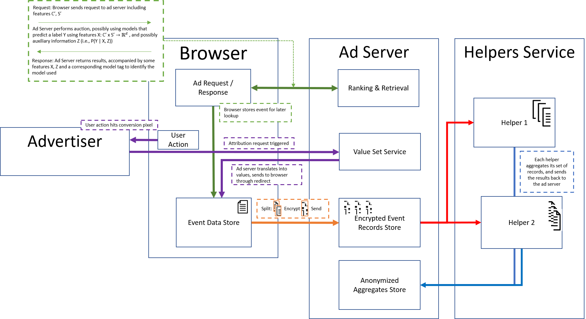

# Masked Learning, Aggregation and Reporting worKflow (Masked LARK)

As described in the [PARAKEET](https://github.com/WICG/privacy-preserving-ads/blob/main/Parakeet.md) proposal, many web advertising data flows currently involve passive
cross-site tracking of users. In order to substantially improve end-user privacy
while allowing sites to continue to sustain their businesses through ad funding,
new privacy-preserving primitives need to be introduced.

The [Aggregate Reporting API](https://github.com/WICG/conversion-measurement-api/blob/main/AGGREGATE.md) proposal outlines a mechanism by which aggregated information from many browsers can be obtained in a privacy preserving manner through the use of ["trusted" helpers]((https://github.com/WICG/conversion-measurement-api/blob/main/SERVICE.md)). The proposal enables richer reporting of cross-site activities such as ad click conversions while still preventing tracking of individual user activities by adding a trusted mediator concept through the use of multiple helpers, none of whom have direct, unencumbered access to individual data records. Secure multi-party computation is leveraged to reduce the level of trust placed in the helpers. Though the proposal is a promising start, significant detail remains to be added to ensure that a more fully-defined specification and the resulting implementations are sufficienlty privacy-preserving. Additionally, the existing proposal does not currently attempt to support some important use cases; notably, the inability for training a conversion model for use by an ad server.

In this document, we propose enriching the existing proposal in the following ways:

1. Describe a detailed computational abstraction of what the browsers and helpers provide.
2. Extend it to support a more complex scenario, model training, which is critical to support in order to move the advertising ecosystem to more privacy-preserving techniques.
3. Keeps all computation performed by the helpers *self-contained*, in the sense that the helpers do not need to communicate with one another (or know anything about each other).

Together, these three aspects both expand the capabilities of previous proposals, while having reduced engineering and overhead requirements for the helper services. We envision allowing each browser (and/or each individual user) to choose from a variety of possible helper settings. This might include selecting specific helpers from a large pool of helpers or choosing how many helpers should be utilized. Additionally, this workflow maintains user privacy by employing additional multi-party computation mechanisms (namely, *masking*) to carry out the additional functionality.

Throughout this document, we attempt to keep definitions similar to previously discussed proposals, except in certain cases to extend their usage.

## Table of Contents
- [Masked Learning, Aggregation and Reporting worKflow (Masked LARK)](#masked-learning-aggregation-and-reporting-workflow-masked-lark)
  - [Table of Contents](#table-of-contents)
- [The Abstraction: A Differentially Private Map-Reduce Framework](#the-abstraction-a-differentially-private-map-reduce-framework)
  - [Notations](#notations)
  - [Framework](#framework)
- [Workflow and API Overview](#workflow-and-api-overview)
  - [Ad Request-Response-Store](#ad-request-response-store)
  - [Attribution Occurs](#attribution-occurs)
  - [Secret Sharing and Sending from the Browser](#secret-sharing-and-sending-from-the-browser)
  - [Aggregation or Model Training Request](#aggregation-or-model-training-request)
  - [Aggregates Returned](#aggregates-returned)
- [Metric Aggregation and Reporting](#metric-aggregation-and-reporting)
  - [Step 1: Browser Actions](#step-1-browser-actions)
  - [Step 2: Ad Server Actions](#step-2-ad-server-actions)
  - [Step 3: Helper action](#step-3-helper-action)
- [Masked Gradient Model Training](#masked-gradient-model-training)
    - [Simplified Example](#simplified-example)
    - [Overhead Considerations](#overhead-considerations)
  - [In depth example](#in-depth-example)
    - [Step 1: Browser Request from Ad Servers](#step-1-browser-request-from-ad-servers)
    - [Step 2: Browser waiting and processing](#step-2-browser-waiting-and-processing)
    - [Step 3: Ad Servers Actions](#step-3-ad-servers-actions)
    - [Step 4: Helpers Compute](#step-4-helpers-compute)
  - [Correctness](#correctness)
- [Other Considerations](#other-considerations)
  - [Keys Revealed Via Helpers](#keys-revealed-via-helpers)
    - [Anonymization of event-level records](#anonymization-of-event-level-records)
    - [Noisy insertions](#noisy-insertions)
  - [Expansion of Model Training](#expansion-of-model-training)
    - [Ad Server Feature and Model Privacy](#ad-server-feature-and-model-privacy)
    - [When to send features](#when-to-send-features)
    - [Large Label Cardinality Quantization](#large-label-cardinality-quantization)
    - [MPC for More General Private Model Training](#mpc-for-more-general-private-model-training)
- [Summarization of Differences with Related Proposals](#summarization-of-differences-with-related-proposals)

# The Abstraction: A Differentially Private Map-Reduce Framework
From the point of view of ad ecosystem participants, a simplified and accurate view of the service provided by the combination of browsers and helpers is important; rather than focusing on a few specific use cases, we detail an abstraction that allows us to reason about a whole family of computations. More precisely, we propose a system where the browsers and helpers work together to implement a differentially private Map-Reduce framework capable of performing a set of computations.

## Notations
We require a number of notations throughout the document, which we outline here.

To start, let **v<sub>u</sub>** ∈ ℝ<sup>d</sup> denote a user-specific private vector of information associated with the user **u**. Such data is stored within a browser, and should never be revealed directly to any helper or ad server. Note: to simplify the notations throughout this document, we drop **u** from the notation when the meaning is clear.

Advertisers and ad servers primarily desire **s** = ⊕ **v<sub>u</sub>**, a vector of statistics (such as summations or counts) over the user base. This includes an advertiser's clicks or conversions aggregated over a particular time window. However, of particular interest to an ad server is also being able to *model* information, so **s** can be a more general notation including, e.g., the gradient with respect to some model (which we occasionally refer to as **g**, when useful).  Note that the *dimensions* of **v** and **s** do not necessarily match.

In order to preserve privacy, the advertiser will generally _not_ receive the exact statistics **s**; instead, they will receive a *privacy-preserving* vector we refer to as **s'**. The function ⊕, introduced above, implements a multi-party compute (MPC) protocol to return **s'** rather than **s**. Finally, we use **v<sub>u</sub>'** to refer to a privacy preserving representation of **v<sub>u</sub>**. 

<a name="noisy"></a>
There are a number of functions and requirements to make **s'** possible.  We use **μ** and **σ** to denote the mean and standard deviation of a distribution *D*. Further, we define the following `noisy` function: 

```
v(1)', ..., v(H)' = noisy(v, H, **kwargs)
```

That is, a browser containing sensitive user information **v<sub>u</sub>** and a preferred set of helpers *H* can transform it into a meaningful *set* of representations **v'**(i) ∀ *H* (each corresponding to the fraction of information to be shared to a helper). However, data contained within the individual fraction **v'**(i) ∀ *H* should appear random when observed in a vacuum. We use `**kwargs` as a placeholder for [additional parameters](https://book.pythontips.com/en/latest/args_and_kwargs.html) that may be needed by a specific instantiation of `noisy`.

## Framework

As a starting point, this framework can be viewed as a sequence of rounds between each browser client and the helpers. 

The browser clients each generate individual user statistics and place them into a record, effectively performing a **Map** operation to create the sparse vector **v**. The browser client then calls `noisy` and `encrypted`, generating data **v<sub>u</sub>**'(h) for the helpers to be used, which are then in turn (via the ad server) passed in batches to the helpers.  Now, the helpers perform a **Reduce** operation to compute **s'**, utilizing an MPC with privacy to compute ⊕.  

In many of the likely use cases for this framework, such as for conversion reporting or model training, we note that there exists additional structure in the data being aggregated. Namely, we have an underlying vector space *V* (which **v<sub>u</sub>** lies in) and have a map defined on that underlying vector space *V* over a field *F*, ⟨·,·⟩: *V* &times; *V* → *F*. This map satisfies a bilinear property with respect to the reduce operation ⊕, i.e., ⟨ ⊕**v<sub>u</sub>**, **w**⟩ = ⊕ ⟨ **v<sub>u</sub>**, **w**⟩.  We leverage this map to implement a *masked* reduce operation that helps us impose privacy considerations in the aggregation. The masked aggregation operation also greatly simplifies reporting and learning use cases of the framework. The idea at a high level allows browsers to interleave real and fake activity in a way that is indistinguishable to both helpers and the ad server. The aggregation step is designed such that only the real records contribute to the result and the fake records are cancelled out.

Additional privacy constraints enforced on top of the aggregation step by the helpers, protecting rarely occurring values. There are several ways to encode the privacy constraints that the helpers implement:

* **Noisy aggregation**: **s'<sub>j</sub>** ∈<sub>R</sub> D(**&mu;<sub>j</sub>** = **s<sub>j</sub>**, &sigma;<sub>j</sub>) means the revealed aggregate is drawn from a distribution with mean equal to the true value **s<sub>j</sub>**, and **&sigma;** = &straightepsilon;**&mu;** for a noise factor &straightepsilon; that can be adjusted depending on the number of users. 
* **Sparse reporting constraint / k-anonymity**: Here, we require a certain number of users in a batch to have non-zero values.  More precisely, let *k* be a positive integer, and we have distinct users *u* ∈ **U**.  If ∑<sub>U</sub> I [**v<sub>u</sub>** &ne; 0] < *k*, then **s'<sub>j</sub>** := 0.

While the noisy aggregation can enforce differential privacy, k-anonymity can provide additional privacy protection which we believe should be required in addition to the differential privacy enforcement. The primary reasons center around ease of use and ease of understanding, particularly for non-domain experts. Note that, k-anonymity alone is insufficient; without differential privacy, "ballot-stuffing" by the ad server would be possible where the ad server could reveal the presence of keys by inserting fake records.

# Workflow and API Overview


Masked LARK follows a similar workflow as [Aggregated Measurement](https://github.com/WICG/conversion-measurement-api/blob/main/AGGREGATE.md), working seamlessly alongside related anonymization proposals like [PARAKEET](https://github.com/WICG/privacy-preserving-ads/blob/main/Parakeet.md). Here, browsers are encouraged to generate *fake* conversion records to send to the ad server (and on to the MPC helpers). The records, both true and fake, may be accompanied by *masks* that either include the true record in the final summation, or exclude the fake record, depending on the function to be performed. We overview the data workflow here, with details concerning how to perform [Metric Aggregation and Reporting](#Metric-Aggregation-and-Reporting) or [Masked Gradient Model Training](#Masked-Gradient-Model-Training) within the framework later.

## Ad Request-Response-Store
In the initial request and response, the attribution tags are sent along similarly to prior protocols by extending the `attributionsourcecontext` tag and adding the `attributionsourcemodels` tag:

```
<a
  attributionsourceeventid="..."
  attributeon="..."
  attributionreportto="..."
  attributionsourcecontext="..."
  attributionsourcemodels="..."> ...</a>
```

As before, `attributionsourcecontext` contains raw feature values provided by the ad server, however now it is defined as a serialized JSON that will be stored in the Event Data Store for later attribution in the `aggregation_key` field, i.e.,:
```
raw_aggregate_payload =
{
  "aggregation_key": <serialized JSON>,
  "aggregation_values": <serialized JSON>, // Assigned during attribution
  "aggregation_noise": <serialized JSON> // Determined by browser or user
}
```

We allow for the browser to set `aggregation_noise` according to a predetermined agreement between browsers and helper service. We currently assume the helpers will eventually implement the *strictest* noise requirement presented, although added flexibility may be explored in the future. This allows the testing of helpers by ad servers and, possibly in the future, varying granularity of privacy as specified by the end user. Masked LARK works well when combined with a service like PARAKEET, where the features can be anonymized before being added to a report; however, the approach is general enough to be applicable without such a service.

Additionally, the ad server may choose to tag an additional term which is a serialized JSON string:

```
raw_attributionsourcemodels := [
    {
        "model_tag": "<string>",
        "model_features": "<byte array>", 
        "model_label_type: "<enum value>",
        "model_label_space": "<define lower and upper>"
        "model_label": <unsigned char/short>, // Assigned during attribution
        "model_mask": <float>, // Assigned During Secret Share Split
        "aggregation_noise": <serialized JSON> // Determined by browser
    },
    ...
]
```

Note the `model_label` must be filled in later. The four other terms will help the ad server to later train models (e.g., a model it identifies as _ConversionModel11005_) with some dense and limited form of features (e.g., model_features is a 100 float vector) to predict a label (e.g., purchase). The `model_label_space` is a critical form that allows us to securely add random noise later for privacy preservation. For `model_features`, a fixed form can be assumed or defined across browsers, e.g., a ushort, and the browser at this point may add local differential privacy to the values.

As with prior proposals, "clicked" and "viewed" events are then stored in the browser.  Additional considerations, such as delayed/scheduled reporting and expiration, still apply. An added requirement is that, when `attributionsourcemodels` is applied, if a conversion never occurs within the specified time window, a "negative" (0) value should be sent upon expiration.

**Note**: this isn't the only way to get feature values to the eventual model training, we discuss this more in the [other considerations](#other-considerations) below.

## Attribution Occurs
Similar to [previous proposals](https://github.com/WICG/conversion-measurement-api/blob/main/README.md#triggering-attribution), the browser will handle conversion pixel redirects to a well-known address with a data package of the form:

```
https://<attributionreportto>/.well-known/attribution-reporting/trigger-attribution[?aggregation_values=<aggregation_values>]
```

This is treated as a special request, with `aggregation_values` containing the conversion information to be attributed. However, `aggregation_values` is now a serialized JSON containing the types of conversions that can be learned. We restrict the serialized JSON to have keys, e.g., "purchase", "visit time" etc, that must come from a predefined enum. Similarly, the values can be restricted to a range (e.g., unsigned char or unsigned short). Thus, the browser can merge the aggregation values provided with other potential values-- if there's attribution found-- and store them within the final corresponding `raw_aggregate_payload`. After the attribution has occurred, the `raw_aggregate_payload` can similarly be stored in the browser event data store.  

When `attributionsourcemodels` are present in the browser's event data store, the browser utilizes the `model_label_type` field present for each model found.  If `model_label_type` matches a key returned by `aggregation_values`, this is inserted into the previously allocated value (above). As with the aggregation form, these can then be stored in the browser's event storage for later usage.

## Secret Sharing and Sending from the Browser
On a predetermined schedule determined by the browser, all records are split via secret sharing in order to allow subsequent helpers to perform MPC. For this, the values of the `aggregation_values` key-value dictionary are secret shared to ensure subsequent helpers can never observe the final values.

For model training, the method is more complex as the trainer requires the true label to compute a gradient. We leave details to a later example, but primarily use *masking* to remove gradient updates that are invalid from the aggregate gradients. In short, an additional masking field `model_mask` is provided to the helpers as well, where the mask across the various helpers will sum to either 0 (remove) or 1 (include). This [mask](https://medium.com/dropoutlabs/secret-sharing-explained-acf092660d97) is utilized in conjunction with generated, or fake, data that should be removed from the final summations. For example, if a conversion does happen, the browser might send two sets of secret shared data to the helpers: one with a mask that ensure a conversion value is included in the final summation, and another that indicates a conversion didn't happen that has a corresponding mask that cancels out the value.  

**Note:** Browsers are encouraged to use masking to generate both fake keys and values which, in later steps, are removed via MPC. More details on masking and their usage are presented in the below examples.


The final (encrypted) payload is then sent to the ad server, with one payload per helper needed to compute the final aggregates:
```
aggregation_service_payload = 
    {
        "mpc_helper": <string>,
        "encryption_standard" : <string>,
        "payload": <byte array>
    }
```

Above, `mpc_helper` defines the corresponding helper that must be used to decrypt the payload.  `encryption_standard` is provided both for allowing testing (`encryption_standard` = "cleartext") and flexibility of encryption protocols that can be used.

**Note:** The browser here always chooses the `mpc_helper` and the `encryption_standard`, and ad servers can always test helpers' accuracy by generating records and verifying the aggregate correctness.

## Aggregation or Model Training Request
After a predetermined time, determined by the ad server, the ad server sends the following requests (one per helper) depending on the `function` (currently "aggregation" or "gradient_computation") to be performed:

```
{
    "origin" : <Location to send result to>,
    "function" : "<action to perform>",
    "aggregation_service_payload_set" : [ // Always Sent
            { "aggregation_service_payload" : <encrypted payload> },
            ...,
    ],
    "aggregation_service_queries" : [ // Aggregation only
        {<string> : <enum-like>, ...}
        ...
    ],
    "aggregation_service_groupby" : [ // Aggregation only
        [<string>, ...]
        ...
    ]
    "aggregation_model_set" : [ // Model Train only
        {
            "model_tag" : "<string>",
            "model_loss_function" : "<enum-like>",
            "model" : "<Serialized ONNX_Model>"
        }, 
        ...
    ]
}
```

The helpers decrypt the payload with their respective private keys and both apply the differential privacy noise and/or *k*-anonymity constraints as required during computation of the aggregation / gradients, prior to sending back their results. For model training, the helpers load the model, compute the gradients with DP noise or clipping and aggregate the mask. The gradient_computation is considered separate from the groupby or query data, and sending both should result in an error.

## Aggregates Returned
After doing a simple aggregation or computing gradients with the privacy protection, each helper returns an object.

As before, `attributionsourcecontext` contains raw feature values provided by the ad server, however now is defined as a serialized JSON that will be stored in the Event Data Store for later attribution in the `aggregation_key` field, i.e.,:

```
raw_aggregate_payload =
{
    "origin" : h,
    "aggregation_service_query_results" : [ // Only for aggregate function
        {"query" : {<string> : <enum-like> ...}, "noisy_aggregates" : { enum-like : {"sum" : <float>, "count" : <float>}, ...}}, 
        ...
    ],
    "aggregation_service_groupby_results" : [ // Only for aggregate function
        {"groupby" : [<string>, ...], "key" : [<enum-like>, ...], "noisy_aggregates" : { enum-like : {"sum" : <float>, "count" : <float>}, ...}}, 
        ...
    ]
    "aggregation_model_set" : [ // Only for gradient compute function
        {
            "model_tag" : "<string>",
            "model_noisy_gradients" : "{<string> : <byte array>, ...}"
        }, 
        ...
    ]
}
```
The ad server can then combine the information across helpers to compute final aggregates to be used in subsequent reporting, model updates, etc.

# Metric Aggregation and Reporting
In this section, we describe an example of how reporting looks by considering an ad server counting conversions.  The network is interested in estimating the number of conversions on a particular subset of data for a given advertiser.  We assume the protocol has agreed upon a sparse reporting constraint of *k* and some time window *T*. In this example, the browser is processing a user city and ad server campaign, with the intent of reporting private aggregates of clicks and purchase price.

## Step 1: Browser Actions
A simple example of the `raw_payload` above might look like:

```
raw_payload =
{
  aggregation_key: {"campaign" : 100, "location" : "seattle"}, // Set from attributionsourcecontext
  aggregation_values: {"view" : 1, "impression" : 1, "click" : 1, "purchase" : 123}, // Set from aggregation_values in redirect
  aggregation_noise: {"standard" : "none"}
}
```

Here, `attributionsourcecontext` is a serialized JSON provided in the initial response from the ad server, while the `aggregation_values` are obtained during a redirect of a conversion pixel.  `aggregation_noise`, for now, is simply "none", and will be expanded in later iterations. In time window *T*, if a browser *i* has activity on a metric for a corresponding `aggregation_key`, it calls the following `noisy` implementation:

```
def noisy(x = {"view" : 1, "impression" : 1, "click" : 1, "purchase" : 123}, H, keys, encryption_standard, aggregation_noise):
    x = { k : generate_secret_share(v, H) for k, v in x.items()}
    for h in range(H):
        payload = {aggregation_key : keys, aggregation_values : {k : v[h]  for k, v in x.items()}, aggregation_noise : aggregation_noise}
        aggregation_service_payload = 
            {
                "mpc_helper": h,
                "encryption_standard" : encryption_standard,
                "payload": encrypt(payload, keys(h))
            }
        yield aggregation_service_payload
```

More explanation of `generate_secret_share` can be found [[here](https://medium.com/dropoutlabs/secret-sharing-explained-acf092660d97)], however, a simple explanation is a function of the form:

* Let *H* be the total number of helpers
* For *h'* in range 1 to *H*-1, Noisy<sup>h</sup>(Value) := Random-Number()
* For *h* == *H*: Noisy<sup>h</sup> := Value + ∑<sub>h' ∉ H</sub> -1 * Noisy<sup>h'</sup>(Value)

For testing, `encryption_standard` is simply "cleartext", but future iterations will fetch keys from the helper and encrypt the payload.

Once all the processing is done from `noisy`, the browser packages it up as a list within `aggregation_service_payloads` previously [defined](https://github.com/WICG/conversion-measurement-api/blob/main/AGGREGATE.md#aggregate-attribution-reports). 

## Step 2: Ad Server Actions
After a fixed set of updates from the browser, the ad server decides to create a conversion rate report.  Given a set of reports *R*, it sends them to the helpers.  Note there's a tradeoff here: gathering more reports reduces the noise in the aggregates and allows for more granular values; however, being able to update metrics and models sooner is critical to most ad servers. Each ad server needs to balance the pros and cons of each for their own needs.

The data is sent to a helper like so, with each helper receiving the encrypted payloads specific to their helper service (via the key used to encrypt the report) along with the same set of queries and groupby operations:

```
{
    "origin" : h,
    "function" : "aggregation",
    "aggregation_service_payload_set" : [
            { "aggregation_service_payload" : encrypted_payload1 },
            { "aggregation_service_payload" : encrypted_payload2 },
            ...,
            { "aggregation_service_payload" : encrypted_payloadR }
    ],
    "aggregation_service_queries" : [
        {"location" : "seattle", "campaign: "100"}
        , {"location" : "new york", "campaign: "100"}
        ...
        , {"location" : "seattle", "campaign: "101"}
    ],
    "aggregation_service_groupby" : [
        ["location"]
        , ["location", "campaign"]
        ...
        , ["location", "campaign", "language"]
    ]
}
```

Note that either direct queries of certain values or a more general GROUP-BY syntax is allowed. The second, in particular, simplifies queries for the ad server and allows them to fetch general statistics about keys without requiring explicit, up front knowledge of what might be in the records, resulting in excess work for the helpers and additional overhead in sending queries.

## Step 3: Helper action
A helper *h* ∈ *H* receives a batch of reports from an ad server, with corresponding key and list of tuples set in `aggregation_service_payload_set`.  For each distinct key, resulting in corresponding records *R*, the helper computes:
* For each record *r* in *R*, compute: ID, Noisy<sup>h</sup>(Value) = Private-Decrypt(*r*)
* If |{ID<sup>r</sup> | ∀ *r* ∈ *R*}| < *k*, return ValueSum := 0
* Else, return ∑ Noisy^h(Value) + Laplace-Noise()

An example function is of the form:

```
def helper_secure_query(aggregation_service_payload_set, query):
    # Decrypt all of the payloads
    decrypted_payloads = [decrypt(payload) for payload in aggregation_service_payload_set]

    # Filter down to payloads that satisfy the query
    decrypted_payloads = [payload for payload in decrypted_payloads.keys() if query_satisfied(query, payload["aggregation_key"])]

    # Find all of the keys that were reported
    value_keys = set([key for keys in decrypted_payloads["aggregation_values"].keys() for key in keys])

    noisy_aggregates = {}
    for key in value_keys:
        values = [payload["aggregation_values"][key] for payload in decrypted_payloads if key in payload["aggregation_values"].keys()]

        if len(values) < k_anon_threshold:
            continue

        noisy_aggregates[key] = { "count" : sum([1 for value in values]) + noise()
                                  "sum" : sum([value for value in values]) + noise()}
    return noisy_aggregates
```

The object returned to the ad server is then of the form:

```
{
    "origin" : h
    "aggregation_service_query_results" : [
        {"query" : {"location" : "seattle", "campaign: "100"}, "noisy_aggregates" : noisy_aggregates1}, 
        {"query" : {"location" : "new york", "campaign: "100"}, "noisy_aggregates" : noisy_aggregates2}, 
        ...
        {"query" : {"location" : "seattle", "campaign: "101"}, "noisy_aggregates" : noisy_aggregatesk}
    ]
}
```

Alternatively, consider a more compact _groupby_ case:

```
def helper_secure_groupby(aggregation_service_payload_set, values, groupby):
    # Decrypt all of the payloads
    decrypted_payloads = [decrypt(payload) for payload in aggregation_service_payload_set]

    # Find all of the keys that were reported
    value_keys = set([key for keys in decrypted_payloads["aggregation_values"].keys() for key in keys])

    # Create Dataframe for common grouping operation efficiency
    pd_decrypted_payloads = pandas.DataFrame(decrypted_payloads)

    all_noisy_aggregates = {}
    for df_key, df_group in pd_decrypted_payloads.groupby(groupby):
        noisy_aggregates{}
        for key in value_keys:
            if len(df_group[value].dropna()) < k_anon_threshold:
                continue

            noisy_aggregates[key] = { "count" : len(df_group[value].dropna()) + noise()
                                      "sum" : sum([value for value in values]) + noise()}
        all_noisy_aggregates[df_key] = noisy_aggregates

    return all_noisy_aggregates
```

The object returned to the ad server is then of the form:

```
{
    "origin" : h
    "aggregation_service_query_results" : [
        {"groupby" : ["location"], "key" : ["seattle"], "noisy_aggregates" : noisy_aggregates}, 
        {"groupby" : ["location"], "key" : ["new york"], "noisy_aggregates" : noisy_aggregates}, 
        ...
        {"groupby" : ["location", "campaign", "language"], "key" : ["seattle", "100", "en"], "noisy_aggregates" : noisy_aggregates}, 
        {"groupby" : ["location", "campaign", "language"], "key" : ["seattle", "100", "es"], "noisy_aggregates" : noisy_aggregates}, 
    ]
}
```

This provides a simplified interface to ad servers for aggregation, while maintaining user privacy.

# Masked Gradient Model Training
A critical focus for this document is to incorporate model *training* into the protocol. Current ad servers often train models to influence bids, auction rankings with a target variable related to whether or not a conversion was met and value of the conversions. The accuracy of such conversion predictions are critical for all parties:

* For the user, it means accurate predictions will show more relevant ads, or perhaps not show any ads at all if none are predicted to be relevant.
* For the advertiser, they are more likely to advertise to an interested user and, in turn, are more likely to sell a product.
* For the publisher, it increases the likelihood of a view or click, increasing the likelihood and value of payments from advertisers.

Here, we show how the above framework is flexible enough to accommodate model training. We also considered several alternatives:

* Federated Learning, where the gradient computation occurs on device.

  In this setup, gradient vectors are pushed to the ad servers in a similar manner as the reporting framework above, which utilizes the helpers to sum the gradients using MPC. This is simple to implement as the browser always has the conversion label. However, the primary drawback of such approach is the need for all ad servers to push their models to be trained to each user's device. As the number of ad servers grow, each with their own models that need training, this can get large and expensive (which could lead to a large impact on battery life, system responsiveness, and bandwidth usage).

* Revealing exact conversions to the helpers.

  This requires increased trust level in helpers with correlatable cross-site conversion information. Although random labels can additionally be returned with some fraction *p*, there's still directly-identifiable information the other *1-p* fraction of the time.

Rather than the above, our proposal leverages the helpers to compute the gradient updates and perform MPC. As user privacy remains central to our proposal, the helpers are never given an actual label ("conversion" or "no conversion"). Instead, the helpers compute gradients for *multiple* possible labels. To determine which gradients are correctly added into the final sum, the browsers provide additional information that will *mask*, or cancel out, the gradients produced by incorrect labels (see [[here](https://medium.com/dropoutlabs/secret-sharing-explained-acf092660d97)]).  Further, the protocol generalizes to additional privacy-preserving techniques that may be worth exploring and incorporating, such as masking the feature vectors from the ad server.

### Simplified Example
As a simple example, consider a user that has converted and the browser is getting ready to send reports. Here, the true "conversion-label" should be 1.  The browser generates two sets of additional random values such that:

* a<sub>0</sub> + a<sub>1</sub> = 0
* b<sub>0</sub> + b<sub>1</sub> = 1

The browser uses the `noise` function and generates four packages (simplified notation):

```
p1 = {"conversion-label" : 0, "multiplier" : a0}
p2 = {"conversion-label" : 1, "multiplier" : b0}
p3 = {"conversion-label" : 0, "multiplier" : a1}
p4 = {"conversion-label" : 1, "multiplier" : b1}
```

These are encrypted with keys (p1 & p2 for helper 0, and p3 & p4 for helper 1) and sent to the ad server, which eventually sends them along to the helpers to perform the multi-party computation.

Each helper computes the gradients with label 0 and label 1, using features and a model provided by the ad server (more discussion on privatization of features later).  Next, the helpers combine the set of gradients using the a and b variables like so:

```
helper 0: g_0 = a0*g(0) + b0*g(1)
helper 1: g_1 = a1*g(0) + b1*g(1)
```

The gradients are sent back to the ad server, which computes a final gradient:

```
final_g = g_0 + g_1 
        = a0*g(0) + b0*g(1) + a1*g(0) + b1*g(1)
        = (a0 + a1)*g(0) + (b0 + b1)*g(1)
        = g(1)
```

Hence, the final gradient is the gradient associated with label 1 Conversely, if the true label of the user was 0, then the masks sent would ensure a0 + a1 = 1 and b0 + b1 = 0. Following the same procedure, the final gradient computed would be g(0).  A more complete analysis is presented [later](#correctness) in the section.

### Overhead Considerations
This framework partially lies within the [click attribution reporting](https://github.com/WICG/conversion-measurement-api/blob/main/README.md#registering-attribution-sources-for-anchor-tag-navigations), requiring attribution of a conversion value event with a source event. However, the source/value pair does not need to be explicitly revealed to the ad server itself; rather, the aggregated gradients are returned for a model update. The tradeoff here is more overhead for either the browser or helpers (or both).

We highlight that our proposal requires *no* interaction between the helpers, as the aggregated gradients per helper can simply be summed, privatized and returned. This greatly simplifies engineering requirements: many helpers can be added for usage, browsers can pick from an array of helpers they want to use, and an unspecified number of helpers can be used for any computation the browser would prefer. This also eliminates the communication overhead between the helpers, speeding up many forms computation as all aggregates can be locally computed.

For additional details regarding how the features are stored and available for model training, we considered following approaches for this:
1. In addition to the attribution source declarations already discussed [in previous proposals](https://github.com/WICG/conversion-measurement-api/blob/main/README.md#attribution-source-declaration), an additional three tags can be provided: `model_tag`, `model_features` and `model_label_space`. The first provides a tag for identifying (to the ad server) which internally used model should consume the provided features, the second the features needed, and third the space of possible label values (needed for sending values that should be masked out).
2. The ad server provides all event-level features for all `attributionsourceeventid` that have occurred within a time frame to the helpers when calling for an update.  The helpers are then charged with joining the event ids provided by the ad servers with the event ids provided by the browser packages.

Of the two, we prefer the first, with the second repeatedly providing unnecessary overhead communication between the ad server and the helpers, and requiring repeated join steps for the helpers. Additionally,
* The feature vector provided should be a dense feature representation.  As the values will simply be a vector of bytes, this can be enforced when the model is evaluated by the helpers (i.e., by requiring a single dense vector as input to an ONNX representation).
* The browser can cap the amount received / stored and throw out excessively large amounts of data
* The browser can assume the dense vector format (e.g., fp16 / fp32) and add noise

To bound the work helpers are expect to perform, we work under the assumption that a helper would only work on a restricted class of models, such as relatively shallow feed-forward DNNs with constrained intermediate vector sizes. We will  Such a representation is restrictive enough to prevent obvious privacy bypasses (e.g., sparse one hot encoded user identifiers), while still providing [relatively strong models](https://competitions.codalab.org/competitions/31485#learn_the_details-technical-details) to be of use to serve relevant ads to user.

The masking criteria requires multiple evaluations of the same models only to mask the incorrect gradient values out. The number of false values must be agreed upon between the browsers, ad servers and helpers -- ideally, no more than two evaluations per event should be required.

<a name="negatives"></a>
In the existing aggregate reporting proposal, only actual conversions require reporting. To train a model, we require both positive samples and negative samples, meaning negative values (i.e., no conversion) also need to be sent to the ad server. We propose extending the [scheduled reports framework](https://github.com/WICG/conversion-measurement-api/blob/main/README.md#sending-scheduled-reports) to handle the negative cases, by sending a value when `attributionexpiry` is reached.

## In depth example
In this section, we elaborate on the above with an in depth example involving all steps undertaken by the corresponding parties.

### Step 1: Browser Request from Ad Servers
As before, the browser issues a request to the ad server.  The data is sent back along with the attribution tag API as discussed above:

```
<a
  attributionsourceeventid="..."
  attributeon="..."
  attributionreportto="..."
  attributionsourcemodels="..."> ...</a>
```

Here, we have the new tag `attributionsourcemodels`, which contains the following serialized JSON structure:

```
[
    {
    "model_tag" : "ConversionModel11005",
    "model_features" : "...", 
    "model_label_space" : {0, 1}
    }, 
    {
    "model_tag" : "ConversionModel11006",
    "model_features" : "...", 
    "model_label_space" : {0, 1}
    } 
]
```

That is, internally, the model *ConversionModel11005* was used in this prediction and the target label being considered is binary 0/1 (e.g., conversion or no conversion). We refer to the values provided as `model_features` as **x** below (after the browser has privatized the vector).

**Note:** We do allow multiple models here to be sent, for the purposes of bootstrap training an additional model.  However, the browser might choose to reject something too large.

**Note:** The browser should add differentially private noise to `model_features`.

### Step 2: Browser waiting and processing
Once the prior information becomes available to the browser, the browser stores it until a condition is met for sending a scheduled report.  When a scheduled report should be sent (for a positive case, or a timed out negative), the browser calls the following [noisy](#noisy) generating function:

```
def noisy(x, H, attributionsourcemodels, false_labels_per_helper, encryption_standard):

    for model_label, model_label_space, model_tag in attributionsourcemodels.items():
        mask_sum_to_1 = generate_masks(H, sum_to_one_or_zero=1)
        mask_sum_to_0 = { i : generate_masks(H, sum_to_one_or_zero=0) for i in range(false_labels_per_helper) }
        random_labels = generate_labels(H, model_label, model_label_space)
        payload = []
        for h in H:
            payload.append({
                    model_features = x, 
                    model_label = model_label,
                    model_mask = mask_sum_to_1[h],
                    model_tag = model_tag
                })

            for i in range(false_labels_per_helper):
                payload.append({
                        model_features = x, 
                        model_label = random_labels[i][h],
                        model_mask = mask_sum_to_0[i][h],
                        model_tag = model_tag
                    })

    random.shuffle(payload)
    aggregation_service_payload = {
            "mpc_helper": h,
            "encryption_standard" : encryption_standard
            "payload": "encrypt(payload)"
    }
    yield aggregation_service_payload
```

Note the additional `generate_masks` function, which will provide values summing to 1 for the true value and 0 otherwise, and the additional `generate_labels`, which generates random labels from the space that do not match `model_label`.

As before, once all the processing is done from `noisy`, the browser packages it up as a list within `aggregation_service_payloads` previously discussed. After following rules for sending an aggregate attribution reports (e.g., random waiting, shuffling the list, etc.), the report is sent.

**Note:** If performing aggregation and model learning, both packages are built separately and returned separately.  The helpers should filter based on type of payloads and the action being performed.

### Step 3: Ad Servers Actions
While responding to browser requests, the ad server determines a sufficient size of records back from the browsers has been received. It sends the following to the helpers (only `aggregation_service_payload` associated with helper `h` are sent):

```
{
    "origin" : h,
    "function" : "gradient_computation",
    "aggregation_service_payload_set" : [
            { "aggregation_service_payload" : encrypted_payload1 },
            { "aggregation_service_payload" : encrypted_payload2 },
            ...
            { "aggregation_service_payload" : encrypted_payloadR },
    ],
    "aggregation_model_set" : [
        {
            "model_tag" : "ConversionModel11005",
            "model_loss_function" : BinaryCrossEntropy,
            "model" : "ONNX_Model"
        }, 
        ...
        {
            "model_tag" : "ConversionModel11061",
            "model_loss_function" : BinaryCrossEntropy,
            "model" : "ONNX_Model"
        }
    ]
}
```

Additionally, the ad server sends the needed ONNX models for evaluation as well as the loss function to use. Note that, for privacy reasons, the model tag is encrypted with other information, meaning the ad server must send all models that could have been served. As the differential privacy and k-anonymity constraints must be applied *per model*, the ad server is incentivized to keep the number of models small.

### Step 4: Helpers Compute
Now, each helper has a `aggregation_service_payload_set` and `aggregation_model_set`. For each `aggregation_service_payloads` list provided, the helper decrypts `aggregation_service_payload` using their private key. This gives them the feature vector **x**, a label *y*, a mask, and a model tag. The helpers always join the model tags with the data, and if privacy requirements are not met for a given model then an empty response is sent.

Now, each helper has a set of features, a set of corresponding labels, a mask, and a model. Each helper computes a gradient **g**<sub>i</sub>, where each element in the *D* dimensional vector is indexed by *g*<sub>i</sub><sup>d</sup>.  Note all helpers, given the same feature, label, model, *must* compute the same *g*<sub>i</sub><sup>d</sup>.  

```
def compute_private_gradients(xs, labels, masks, model):
    private_gradients = [ mask * compute_gradient(x, label, model) for mask, x, label in zip(masks, xs, labels) ]
    return sum(private_gradients) + noise(),  len(private_gradients) + noise()
```

Whether to return a sum or average, or support additional optimization methods like ADAM we leave to future discussion as they have the same basic return structure.  After the model gradients have all been computed for all models, return the set:

```
{
    "origin" : h,
    "aggregation_model_set" : [
        {
            "model_tag" : "ConversionModel11005",
            "model_noisy_gradients" : "compute_private_gradients(...)"
        }, 
        ...
        {
            "model_tag" : "ConversionModel11061",
            "model_noisy_gradients" : "compute_private_gradients(...)"
        }
    ]
}
```

The ad server receives from all helpers their gradients, adds them and updates the model (for example).

## Correctness
<a name="correctness"></a>
Each helper computes a gradient **g**<sub>i</sub>, where each element in the *D* dimensional vector is indexed by *g*<sub>i</sub><sup>d</sup>.  Note all helpers, given the same feature, label, model, *must* compute the same *g*<sub>i</sub><sup>d</sup>.  Let α be the masks provided by the browsers.  Together, the helpers compute the gradient *g*<sup>d</sup>, which we leave as *g* for simplicity below:

*g* = ∑<sub>i ∈ N</sub>∑<sub>r ∈ R</sub>∑<sub>h ∈ H</sub> α<sup>h</sup><sub>r</sub> * g<sub>i,r</sub><sup>h</sup>

*g* = ∑<sub>i ∈ N</sub>∑<sub>r ∈ R</sub>∑<sub>h ∈ H</sub> α<sup>h</sup><sub>r</sub> * g<sub>i,r</sub>

*g* = ∑<sub>i ∈ N</sub> ∑<sub>r ∈ R </sub>g<sub>i,r</sub> * [∑ <sub>h ∈ H</sub> α<sup>h</sup><sub>r</sub>] 

Note in the above, for every *i* the sum in the bracket is either 0 or 1, with exactly 1 summation being 1 iff it's the true gradient and 0 otherwise.  Let *g*<sup>+</sup><sub>i</sub> be the true gradient for a sample.  All the zero terms are removed from the summation, resulting in:

*g* = ∑<sub>i ∈ N</sub> g<sup>+</sup><sub>i</sub>

Which is what we want to see.

# Other Considerations
There are multiple related considerations that we briefly touch on here.

## Keys Revealed Via Helpers
Although we discuss multiple aspects of the privacy considerations here, one expansion on previous proposals is to allow of more general key lookups which provide more flexibility to various parties. However, this could open the service to attacks by ad servers which insert fake records, in order to extract whether a conversion occurred. This should be mitigated in a couple of ways:

### Anonymization of event-level records
Usage of an intermediate service like PARAKEET, which anonymizes the information sent to an ad servers at ad request time. Such a representation allows for the browser to possibly always return event-level data with the privatized keys, however, additionally employ a similar masking strategy to remove the records in aggregate.

### Noisy insertions
Adding noisy data can obfuscate records and privatize user information. One approach would be to have an additional helper could be used which inserts additional fake records, then passes on the full set to the helpers to do the computation. Another option is to have the browser have the added responsibility to insert random records at intermittent points; however, it may be challenging for an individual client to come up with a convincingly fake record without an outside service assisting it.

## Expansion of Model Training
The proposed gradient computation proposes a simple gradient computation which is passed back to the ad server.  However, a more general service could allow the helpers to function as a trainer for the ad servers for secure model training, with repeated communication about batches that update an intermediate model, provide losses, and so forth, back to the ad server.

### Ad Server Feature and Model Privacy
One other consideration is the exposure of the ad servers' feature vectors to the browser (which, in turn, could provide it to the helpers) which the ad server might prefer to keep private. There are a couple of possible mitigations to this:
* The ad server can choose to privatize its vector by sending it as, for example, a random projection or some form of autoencoder in order to hide the raw feature values.
* With some additional overhead, the ad server can send **x** as two forms to the browser, **x** = **x**<sub>1</sub> + **x**<sub>2</sub>, where these appear randomly generated to privatize **x**.  After the first neural network layer, the helpers can sync to recover the subsequent intermediate values.  This comes at a price: intermediate values must be shared per example and helpers must now handle syncing with these helpers.

Similarly, an ad server might prefer to keep its model private. Let *L* be a layer and *L<sub>1</sub>* + *L<sub>2</sub>* = *L*: we can send each of the privatized layers to each helper and maintain the model privacy. As before, communication must be introduced between the helpers for this at each intermediate layer.

In general, given the associated costs, an ad server privatizing the feature vector via a random projection or autoencoder is preferred.

### When to send features
As described earlier, feature vectors are always sent as part of the response and we require a feature vector per model. Another option is to omit this piece, and have the ad server send all feature vectors to the helpers with a corresponding event ID. The helpers would then join the feature vectors with the labeled data, compute the gradient, and send a result. This second option requires quite a bit more computation from the helpers to do the join operation, as well as the need to send over many feature vectors that might have no corresponding values. However, this trade off may be appropriate as it allows less data to be sent to the browser, and also allows for an ad server to train a new model with old data. We leave this for future discussion.

### Large Label Cardinality Quantization
When considering simpler label spaces, e.g., binary cross entropy, it becomes clear that simply sending all possible labels (with a mask) obfuscates which label is true.  In the case of larger cardinality label spaces (e.g., the real numbers) it isn't ideal to have the true label hidden within a small number of false numbers, where the true value might stand out regardless of attempts to hide it. This might persist even with bounding of the possible outputs.  There are couple of ways to mitigate this.

The first is that the browser, at some random interval, can send a set of values that are *all* masked out, placing sufficient doubt on any values sent over as being legitimate. For the second, we propose requiring a quantization of the space. That is, for any real valued space, the browser can require bucketing with varying granularities (perhaps configurable by a user), based on the bounding limits.  Let *q<sub>i</sub>*, *q<sub>i+1</sub>* be two quantized buckets around a true value *c*, i.e., *q<sub>i</sub>* ≤ *s* ≤ *q<sub>i+1</sub>*.  With probability (*s* - *c<sub>i</sub>*) / (*c<sub>i+1</sub>* - *c<sub>i</sub>*), *s'* = *c<sub>i</sub>* is set, otherwise *s'* = *c<sub>i+1</sub>* is set. *s'* is then sent to the helpers with appropriate masking, along with additional samples drawn uniformly (without replacement) from *c*. It's expected that the values *s'* are unbiased w.r.t. *s* but prevent unique identification of a value.  n the extremum, the two endpoints of the bounded real line are used as the *only* two *q<sub>i</sub>*, *q<sub>i+1</sub>* allowed by the browser. Both are sent (with appropriate masks) to the helpers, removing all knowledge of the true value.

### MPC for More General Private Model Training
The use of masked gradients is proposed as an incredibly lightweight approach for model training in order to minimize overhead. In this framework, no helpers need to communicate with each other, allowing the browsers to completely isolate helpers from each other and the helpers to simply do one computation and return results. For more flexibility, we can consider relaxing this requirement and allow the helpers to communicate in intermediate stages during MPC, using a method like [SecureNN](https://eprint.iacr.org/2018/442.pdf). This has both the additional complexity of intermediate communication for the gradients, as well as the helpers possibly communicating with different helpers at various intermediate stages, requiring additional design work.
# Summarization of Differences with Related Proposals
This proposal has a number of similarities to [prior aggregate reporting APIs](https://github.com/WICG/conversion-measurement-api/blob/main/AGGREGATE.md), including building on previously defined browser tags, recycling of existing pixel conversion redirect data, and leveraging MPC with multiple helpers for the secure aggregation.  However, here we highlight a few differences.

* We propose using noisy browser insertions and deletions to remove granular information about a user, rather than utilizing a distributed point function to hide the keys.
* Our proposal allows for oblivious computation on the part of the helpers, with no necessary interactions between helpers.  This allows for a variety of browser (user) settings and choices of helpers, new helpers can easily onboard, ease of engineering for all parties involved, and minimal communication overhead during aggregation and training.
* We illustrate how we can using masking to train a variety of models without revealing the target value, and discuss how the browser can handle large cardinality labels through quantization.
* We restructure a few pieces, such as `attributionsourcecontext` and `aggregation_values`, to allow a more expressive serialized JSON, and add a new tag `attributionsourcemodels` to handle the modeling features. We allow more general GROUP-BY operations between the ad servers and the helpers, for easier queries from the helpers.
